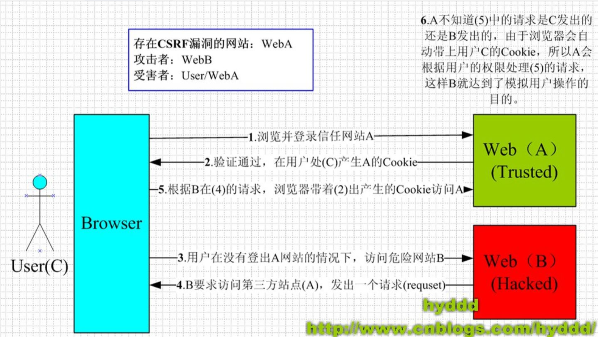

- [什么是CSRF？](#什么是csrf)
- [攻击流程，实例](#攻击流程实例)
- [防御方式](#防御方式)
- [产生的危害](#产生的危害)
- [常用检测方法](#常用检测方法)
- [Django中CSRF应用](#django中csrf应用)

## 什么是CSRF？

原理：利用目标用户的合法身份，以用户的名义来执行一些非法操作

并不需要获取用户的cookie，相当于当用户点击恶意页面时，恶意页面会去访问用户已登录过的目标网站，而且此时用户的cookie仍在，未过期，可以利用。

该漏洞的产生源于web的隐式身份验证机制，即利用cookie来保证一个请求是来自合法用户的浏览器，但无法保证该请求是用户批准发送的。

产生的原因：
* 请求所有的参数均可确定（便于攻击者构造恶意链接）
* 请求的审核不严格  如只审核cookie




## 攻击流程，实例

* 假设abc用户登录银行的网站进行操作, 同时也访问了攻击者预先设置好的网站.

* abc点击了攻击者网站的某一个链接,这个链接是http://www.bank.com/xxxx指向银行,银行服务器会根据这个链接携带的参数会进行转账操作.

* 银行服务器在执行转账操作之前会进行SESSION验证是否登录, 但是由于abc已经登录了银行网站,攻击者的链接也是www.bank.com.所以攻击的链接就会携带session id到银行服务器.

* 由于session id是正确的,所以银行会判断操作是由本人发起的,执行转账操作.

## 防御方式
自动化探测工具：CSRFTester和burpsuite的CSRF POC

1. **HTTP referer头**
   1. referer字段**记录http请求的原地址**（实际上就是告诉服务器，用户在访问当前资源之前的位置，可用于跟踪用户），如伪造用户发出请求的恶意网站的地址，服务端判断Referer值是否与服务器的域名信息有关，不相关时不执行操作。[HTTP Referer教程](http://www.ruanyifeng.com/blog/2019/06/http-referer.html)
   >有三种场景会发送Referer字段
   (1)用户点击网页上的链接
   (2)用户发送表单
   (3)网页加载静态资源，比如加载图片、脚本、样本（这样可以防止一些别的网站显示自己网站的图片等资源）
   2. referer由浏览器产生，但可利用浏览器自身的一些安全问题，来修改该字段值
   3. 绕过：
      1. 当Referer为空的条件：利用ftp:// http:// https:// file:// javascript:  data:
         1. 利用data：协议
         2. 利用https协议   https向http跳转的时候referer为空
      2. 判断Referer是某域
      3. 判断Referer是否存在某关键词
      4. 判断referer是否有某域名
         1. 添加文件名为域名的路径
         2. https://www.ibm.com/ibmweb/myibm/profile/profile-edit.jsp--》http://my_website/www.ibm.com/ibmweb/myibm/profile/profile-edit.jsp.php
2. **设置Token**
   1. 使用流程：服务器生成Token，并输出到页面中--》页面提交的请求携带这个Token--》服务端验证Token是否正确。
   2. 在网站表单中添加随机Token，服务端需验证Token值来判断请求是否合法。服务端按照一定方法生成或者完全随机生成Token，传到前端的表单中。
   3. 攻击者不知道Token生成的规则，或者无法利用js获取其他域的token值（同源策略）
   4. 在burpsuite中需要repeater时，如何获取token？使用bp宏自动获取token，保障session不过期。使用bp宏获取Token
   5. 绕过：
3. **HTTP自定义头**
4. **二次验证**
   1. 执行操作时弹框提示用户确定执行操作
5. **验证码防御**
   1. 通过验证码强制用户与应用程序交互才能完成操作

## 产生的危害

* 篡改目标网站上的用户数据；
* 盗取用户隐私数据；
* 作为其他攻击向量的辅助攻击手法；
* 传播CSRF蠕虫。

## 常用检测方法
1) 黑盒
* 首先肯定确定是否除Cookie外其他参数均可确定，即：无验证码，无Token等。
* 再者如果发现是Referer头判断的话，可以尝试是否可以绕过正则。
* 还有就是考虑能不能绕过Token，比如Url处的Token用加载攻击者服务器上的图片来获取。
* 最后可以考虑与XSS结合，如：攻击者使用iframe跨域，存在xss漏洞的网站插入的XSS执行代码为eval(window.name)，那么我们构造的iframe标签里可以添加个name属性与子页面进行通信，例子：wooyun-2015-089971。

2) 白盒
* 查看是否有Token，验证码，Referer等不确定参数判断。
* 判断Referer的正则是否安全。
* 判断Token返回的位置是否为安全位置。
* 判断生成的Token是否足够随机，毫无规律。

从上到下挖掘难度依次递增


## Django中CSRF应用

1. 在Django中的中间件开启CSRF验证
   
   在settings.py中  添加'django.middleware.csrf.CsrfViewMiddleware'
2. 在form表单中添加csrf_token
```
<form action="/login/" method="post">        
        <input type="text" name="user" />
        <input type="text" name="pwd" />
        <input type="checkbox" name="rmb" value="1" /> 10s免登录
        <input type="submit" value="提交" />
</form>
```

3.利用ajax添加csrf_token
```
<script>        var csrftoken = $.cookie('csrftoken');
        $(function () {
            $('#btn').click(function () {
                $.ajax({
                    url:'/login/',
                    type:"POST",
                    data:{'username':'root','pwd':'123123'},
                    header:{'X-CSRFtoken':csrftoken},
                    success:function (arg) {
                    }
                })
            })
        })
</script>
```

ajaxSetup方法可为所有ajax请求做集体配置
```
$.ajaxSetup({
            beforeSend: function(xhr, settings) {
                if (!csrfSafeMethod(settings.type) && !this.crossDomain) {
                    xhr.setRequestHeader("X-CSRFToken", csrftoken);
                }
            }
        });
```
