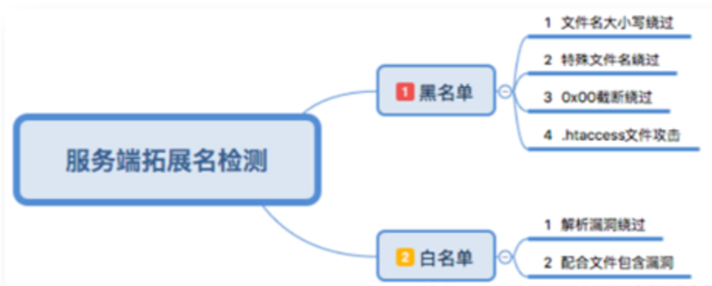

- [基本概念](#基本概念)
- [检测与绕过](#检测与绕过)
  - [客户端检测（JavaScript检测）](#客户端检测javascript检测)
  - [服务端检测（MIME类型检测）](#服务端检测mime类型检测)
  - [服务端检测（目录路径检测）](#服务端检测目录路径检测)
  - [服务端检测（文件扩展名检测）](#服务端检测文件扩展名检测)
- [服务器解析漏洞](#服务器解析漏洞)
- [防御](#防御)

## 基本概念
**文件上传漏洞**是指由于程序员在对用户文件上传部分的控制不足或者处理缺陷，而导致的用户可以越过其本身权限向服务器上上传可执行的动态脚本文件（木马、病毒、恶意脚本、WebShell）。

该漏洞的关键在于：
* 绕过种种限制，上传可利用的文件
* 文件上传后，服务器怎么处理、解释文件

利用网页代码中的文件上传路径变量过滤不严格，将可执行文件上传到一个服务器中，再通过URL去访问以执行恶意代码。

## 检测与绕过

### 客户端检测（JavaScript检测）
原理：在表单提交时使用js函数来检查上传文件的扩展名。

前台脚本检测扩展名：当用户在客户端选择文件点击上传时，客户端还没有向服务器发送任何消息，就对本地文件进行检测来判断是否是可以上传的类型。

绕过方法：

* 使用js脚本检测时，直接禁用JS（NoScript插件、IE直接禁用）
* 先修改木马后缀名，再用抓包工具修改   如将shell.asp改成shell.jpg

### 服务端检测（MIME类型检测）
原理：

HTTP协议规定了上传资源的时候在Header中加上一项文件的MIMETYPE，来识别文件类型，这个动作是由浏览器完成的，服务端可以检查此类型不过这仍然是不安全的,因为HTTP header可以被发出者或者中间人任意的修改。

绕过方法

使用各种各样的工具（如burpsuite）强行篡改Header就可以，将Content-Type: application/php改为其他web程序允许的类型。

常见MIME类型：
* audio/mpeg -> .mp3
* application/msword -> .doc

* application/octet-stream -> .exe

* application/pdf -> .pdf

* application/x-javascript -> .js

* application/x-rar -> .rar

* application/zip -> .zip

* image/gif -> .gif

* image/jpeg -> .jpg / .jpeg

* image/png -> .png

* text/plain -> .txt

* text/html -> .html

* video/mp4 -> .mp4

### 服务端检测（目录路径检测）
在文件上传时，允许用户将文件放到指定的目录中，如果不存在指定目录，就会先创建目录再将文件放入。

原理

结合IIS解析漏洞，当建立*.asa、*.asp格式的文件夹时，其目录下的任意文件都将被IIS当做asp文件来解析

绕过：/123.php%00.jpg/123.jpg -> /123.php

### 服务端检测（文件扩展名检测）

原理：文件上传到服务端时，对文件名的扩展名进行检查，如果不合法则拒绝上传
两种策略：
* 黑名单：名单中存储不合法的后缀名
  * 绕过：
    * 从黑名单中找到web开发者忽略的扩展名
    * 大小写绕过
    * Windows下，如果文件名以”.“或空格结尾，会自动去除，eg：asp. 转化为asp
* 白名单：名单中存储合法的，只有在名单中的才可以被上传
  * 利用一些**解析漏洞**
    * IIS中： *.asp;1.jpg-->*.asp

- 

## 服务器解析漏洞

**Apache解析漏洞：**

- 从右向左解析文件后缀名，直至解析到可识别的后缀。
  - 若一个文件名abc.x1.x2.x3，Apache会从x3开始解析，如果x3不是一个能解析的扩展名，就往前解析x2以此往复，直到能遇到一个能解析的文件名为止。

**IIS解析漏洞：**
- 目录解析：如果任意目录名包含 .asp 字符串，那么这个目录下的所有文件 都会按照 asp 去解析
- 后缀解析：/xx.asp;.jpg /xx.asp:.jpg(此处需抓包修改文件名) 即asp文件后面添加; : ，在实际解析时仍会当作asp文件执行
- 只要对任意文件名在url后面追加上 字符串 / 任意文件名.php 就会按照php去解析。（IIS7.0）
  - 例如，上传test.jpg，然后访问test.jpg/.php或test.jpg/abc.php当前目录下就会生成一句话木马 shell.php

**Nginx解析漏洞：**
- www.xxx.com/test.jpg/test.php 会把test.jpg当成php解析

## 防御
**系统运行时的防御：**

- **文件上传的目录设置为不可执行。**只要web容器无法解析该目录下面的文件，即使攻击者上传了脚本文件，服务器本身也不会受到影响，因此这一点至关重要。
- **判断文件类型。**在判断文件类型时，可以结合使用MIME Type、后缀检查等方式。在文件类型检查中，强烈推荐白名单方式，黑名单的方式已经无数次被证明是不可靠的。此外，对于图片的处理，可以使用压缩函数或者resize函数，在处理图片的同时破坏图片中可能包含的HTML代码。
- **使用随机数改写文件名和文件路径。**文件上传如果要执行代码，则需要用户能够访问到这个文件。在某些环境中，用户能上传，但不能访问。如果应用了随机数改写了文件名和路径，将极大地增加攻击的成本。再来就是像shell.php.rar.rar和crossdomain.xml这种文件，都将因为重命名而无法攻击。
- **单独设置文件服务器的域名。**由于浏览器同源策略的关系，一系列客户端攻击将失效，比如上传crossdomain.xml、上传包含Javascript的XSS利用等问题将得到解决。
- **使用安全设备防御。**文件上传攻击的本质就是将恶意文件或者脚本上传到服务器，专业的安全设备防御此类漏洞主要是通过对漏洞的上传利用行为和恶意文件的上传过程进行检测。恶意文件千变万化，隐藏手法也不断推陈出新，对普通的系统管理员来说可以通过部署安全设备来帮助防御。

**系统开发阶段的防御**

系统开发人员应有较强的安全意识，尤其是采用PHP语言开发系统。在系统开发阶段应充分考虑系统的安全性。

对文件上传漏洞来说，最好能在客户端和服务器端对用户上传的文件名和文件路径等项目分别进行严格的检查。客户端的检查虽然对技术较好的攻击者来说可以借助工具绕过，但是这也可以阻挡一些基本的试探。服务器端的检查最好使用白名单过滤的方法，这样能防止大小写等方式的绕过，同时还需对%00截断符进行检测，对HTTP包头的content-type也和上传文件的大小也需要进行检查。

**系统维护阶段的防御**

系统上线后运维人员应有较强的安全意思，积极使用多个安全检测工具对系统进行安全扫描，及时发现潜在漏洞并修复。

定时查看系统日志，web服务器日志以发现入侵痕迹。定时关注系统所使用到的第三方插件的更新情况，如有新版本发布建议及时更新，如果第三方插件被爆有安全漏洞更应立即进行修补。

对于整个网站都是使用的开源代码或者使用网上的框架搭建的网站来说，尤其要注意漏洞的自查和软件版本及补丁的更新，上传功能非必选可以直接删除。除对系统自生的维护外，服务器应进行合理配置，非必选一般的目录都应去掉执行权限，上传目录可配置为只读。