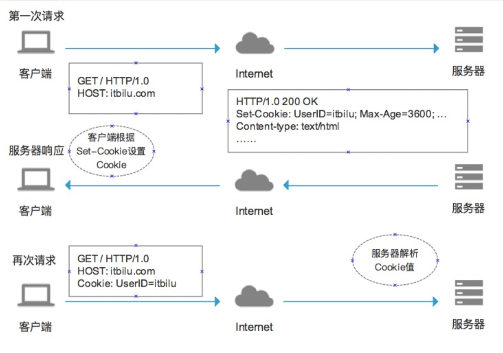
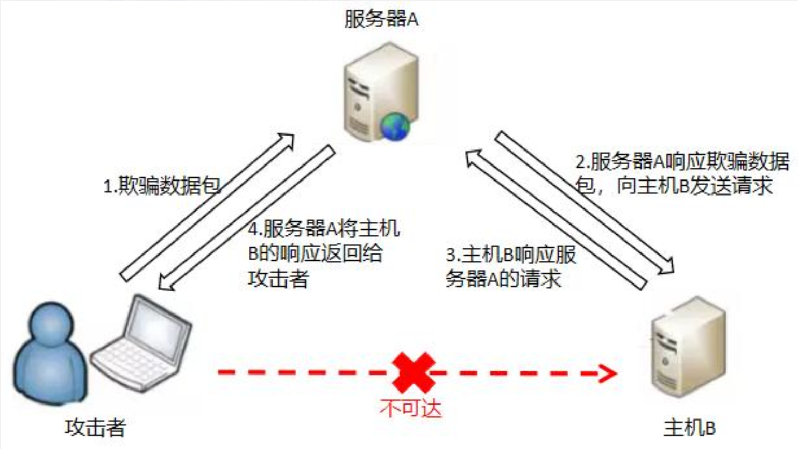

# SQL注入
- [SQL注入](#sql注入)
  - [SQL注入成因？ 😉😉](#sql注入成因-)
  - [SQL注入防护方法？ 😉😉](#sql注入防护方法-)
  - [SQL注入如何判断](#sql注入如何判断)
  - [SQL注入主要类型？😉😉](#sql注入主要类型)
  - [联合查询的运用场景？](#联合查询的运用场景)
  - [报错注入的函数有哪些？](#报错注入的函数有哪些)
  - [布尔型注入方式？使用的函数？](#布尔型注入方式使用的函数)
  - [时间盲注方式？常用函数？](#时间盲注方式常用函数)
  - [堆叠注入？](#堆叠注入)
  - [宽字节注入？](#宽字节注入)
  - [HTTP头部注入可能参数点？原因？](#http头部注入可能参数点原因)
  - [二阶注入？](#二阶注入)
  - [sql注入写文件用的函数？](#sql注入写文件用的函数)
  - [sql注入写shell的条件？](#sql注入写shell的条件)
  - [不同数据库获取数据信息的过程](#不同数据库获取数据信息的过程)
- [XSS](#xss)
  - [XSS攻击如何产生？](#xss攻击如何产生)
  - [主要类型以及原理？](#主要类型以及原理)
  - [XSS危害](#xss危害)
  - [如何防护](#如何防护)
- [CSRF](#csrf)
  - [什么是CSRF？](#什么是csrf)
  - [攻击流程，实例](#攻击流程实例)
  - [防御方式](#防御方式)
  - [产生的危害](#产生的危害)
  - [常用检测方法](#常用检测方法)
  - [Django中CSRF应用](#django中csrf应用)
- [SSRF](#ssrf)
  - [漏洞原理](#漏洞原理)
  - [可以做什么](#可以做什么)
  - [常利用的相关协议](#常利用的相关协议)
  - [漏洞相关的函数](#漏洞相关的函数)
  - [限制方法及如何绕过](#限制方法及如何绕过)
  - [Gopher协议的应用](#gopher协议的应用)
    - [协议内容](#协议内容)
    - [发送请求](#发送请求)
  - [攻击内网Redis](#攻击内网redis)
    - [Redis未授权访问漏洞](#redis未授权访问漏洞)
- [文件上传漏洞](#文件上传漏洞)
  - [基本概念](#基本概念)
  - [检测与绕过](#检测与绕过)
    - [客户端检测（JavaScript检测）](#客户端检测javascript检测)
    - [服务端检测（MIME类型检测）](#服务端检测mime类型检测)
    - [服务端检测（目录路径检测）](#服务端检测目录路径检测)
    - [服务端检测（文件扩展名检测）](#服务端检测文件扩展名检测)
  - [服务器解析漏洞](#服务器解析漏洞)
  - [防御](#防御)


## SQL注入成因？ 😉😉

根本原因：未经检查或未经充分检查的用户输入数据，意外变成了代码被执行。

根本上防止：避免数据变成代码被执行，分清数据和代码的界限

一个是在**动态构造SQL语句**时，产生一些比较危险的语句，在执行SQL之后，获取了多余的数据；
另一个是**数据库的配置**，一个SQL查询应该只能查询到数据库允许被查询到的数据。

- 动态字符串的构造


1. 转义字符处理不当   对于数据库而言，' '单引号内的内容均是数据，是需要查询的

2. 类型处理不当

3. 查询语句组装不对

4. 错误处理不当

5. 多个提交处理不当

- 数据库配置不安全

**两个关键条件：**

1. 用户可以控制输入
2. 程序执行的代码拼接了用户输入的数据，把用户数据当代码执行。

**本质：**
数据和代码未分离，数据当成代码执行

- 对用户端输入过滤不严格
- 可以带入数据库中进行查询操作

## SQL注入防护方法？ 😉😉 
从不同角度切入：

**1. 传入的字符**
   - 对输入的特殊字符(如, () * & % # 等等)进行Escape转义或过滤、替换、删除等处理
     - escape() 会对字符串中除了ASCII字母、数字和特定符号外，进行转义编码，编码成字符的16进行格式值，当该值小于等于0xFF时,用一个2位转移序列: %xx 表示. 大于的话则使用4位序列:%uxxxx 表示。
   - 输入内容的数据类型必须确定，要么数字型，要么字符型 
  
**2. 查询操作本身**
   - 使用安全的API，即所有查询语句使用标准化的数据库查询语句API接口，设定语句的参数进行过滤一些非法的字符，防止用户输入恶意字符传入数据库中执行sql语句。(如果直接将获取的参数传入预编译语句中，也有可能产生**二次注入**，即从数据库中查询出**恶意数据**)
   >**数据库预编译：**
   >
   > (1) 数据库SQL语句编译特性：
    **数据库接受到sql语句之后，需要词法和语义解析，优化sql语句，制定执行计划**。这需要花费一些时间。但是很多情况，我们的一条sql语句可能会反复执行，或者每次执行的时候只有个别的值不同（比如query的where子句值不同，update的set子句值不同,insert的values值不同）。
   > 
   >(2) 减少编译的方法
    如果每次都需要经过上面的词法语义解析、语句优化、制定执行计划等，则效率就明显不行了。为了解决上面的问题，于是就有了预编译，**预编译语句就是将这类语句中的值用占位符替代，可以视为将sql语句模板化或者说参数化**。**一次编译、多次运行，省去了解析优化等过程**。
   > 
   >(3) 缓存预编译
    预编译语句被DB的编译器编译后的执行代码被缓存下来,那么下次调用时只要是相同的预编译语句就不需要编译,只要将参数直接传入编译过的语句执行代码中(相当于一个涵数)就会得到执行。
    并不是所以预编译语句都一定会被缓存,数据库本身会用一种策略（内部机制）。
   > 
   >(4) 预编译的实现方法
    预编译是通过PreparedStatement和占位符来实现的。
   >
   >mysql:
   >
   >$ mysqli=new mysqli();
   >
   >$ mysqli->prepare($sql);

  
  
  
  
**3. 数据库本身**
   - 对用户的操作权限进行安全限制，普通用户只给普通权限，管理员后台的操作权限要放开，尽量减少对数据库的恶意攻击。
   - 执行的错误信息不要返回到客户端显示，（如字符错误，数据库的报错信息）尽量减少泄露信息

## SQL注入如何判断
  单条件查询：select * from table where id=?
  多条件查询：select * from table where id1=? and id2=?

  1.首先需要判断字符型还是整型：
  对于一个可能的注入点：
  - ?id=1   正常显示
  - 模式1：
    - 基于该种模式还有很多种变型，核心思想还是（字符型闭合已有的SQL语句，）增加一些附加条件来判断条件是否执行，若执行了说明存在sql注入。
    - 闭合已有SQL语句的方式：' " ) ') 
    - ?id=1 and 1=1   显示正常
    - ?id=1 and 1=2   显示异常  --》整型注入
    - ?id=1' and '1'='1   显示正常
    - ?id=1' and '1'='2   显示异常 --》字符型注入
  - 模式2：
    - 后端的waf过滤了关键字and or--》使用连接符
    - 与
      - and 
      - &&
      - &
    - 或
      - or
      - ||
      - |
    - 异或
      - ^

  2.判断出存在注入后，需要确定**注入类型**，再继续进一步的操作。


## SQL注入主要类型？😉😉

- 按数据类型分类
  - 数字型注入
  - 字符型注入
- 按注入语法分类
  - 联合注入
  - 报错注入
  - 布尔注入
  - 时间注入
  - 堆叠注入
  - Cookie注入
- 按不同注入点
  - select注入
  - insert注入
  - update注入
  - delete注入

## 联合查询的运用场景？

网页上会将服务端执行的SQL语句查询结果直接显示在页面上，显示数据的位置为**显示位**。

- union select 要求查询列数一致。
- concat、concat_ws将多列结果拼接为一列
- group_concat将多行结果拼成一行输出

## 报错注入的函数有哪些？

- **floor函数**
select count(*),concat(/*payload*/,floor(rand(0)*2)) as x from user group by x;

    floor()报错注入的原因是group by在向临时表插入数据时，由于rand()多次计算导致插入临时表时主键重复，从而报错，又因为报错前concat()中的SQL语句或函数被执行，所以该语句报错且被抛出的主键是SQL语句或函数执行后的结果。

- **extractvalue报错**

    它接收两个字符串参数，第一个参数可以传入目标xml文档，第二个参数是用Xpath路径表示法表示的查找路径。这里如果Xpath格式语法书写错误的话，就会报错。
    可以利用concat函数将想要获得的数据库内容拼接到第二个参数中，报错时作为内容输出
    ?id=1  and extractvalue(1, (payload))
    eg payload:
    concat(0x7e,(select @@version),0x7e) 

- **updatexml报错**
  
    UpdateXML(xml_target, xpath_expr, new_xml)xml_target：需要操作的xml片段
    
    xpath_expr：需要更新的xml路径(Xpath格式)
    
    new_xml：更新后的内容
    
    不过这些参数都不太重要，这里和上面的extractvalue函数一样，当Xpath路径语法错误时，就会报错，报错内容含有错误的路径内容：

    ?id=1  and updatexml(1,(payload),1)
    
    eg payload:
    
    concat(0x7e,(select @@version),0x7e))
    
    注意：extractvalue和updatexml的查询结果均有长度限制，显示结果可能不全，可分多次查询，利用limit、reverse、left、right等
    
    ExtractValue()和UpdateXml()类似，它们的第二个参数使用Xpath路径法表示的查找路径。这里如果Xpath格式语法书写错误的话，就会报错。利用concat函数将想要获得的数据库内容拼接到第二个参数中，报错时作为内容输出。

## 布尔型注入方式？使用的函数？
原理：
通过注入我们的恶意语句来得到使得服务器将我们的恶意语句（存在判断数据是否正确）带入到查询中，然后通过返回的页面来判断是否是正确的判断逻辑。

1.如果页面既没有显示位,也没有报错提示的话,可以使用布尔注入.

2.通过插入一些语句查看结果来判断是否存在布尔注入.

常用函数：
- length(select database())>5  #length()里可以放查询语句,用来判断查询结果的长度

- exists( )      #exists()里可以放查询语句,用来判断查询结果是否存在

- ascii( )     #ascii()里可以放查询语句,用来把查询结果转换为ascii的值
  
- ord(string)     返回字符串首字母的ascii码值
- substr( string,pos,length)  #用来截取查询结果,string可以用查询语句代替,pos表示截取位置--下标从1开始,length表示截取的长度;
- mid(string,start,length)  返回字符串从start位置开始的长度为length的子字符串

## 时间盲注方式？常用函数？

如果布尔注入也不行，则可使用时间盲注。
- IF(Condition,A,B)函数 
  - 当Condition为TRUE时，返回A；当Condition为FALSE时，返回B。
  - eg：if(ascii(substr(“hello”, 1, 1))=104, sleep(5), 1)
  - Condition为常用上面的几个函数

## 堆叠注入？

sql语句一般以;结尾，代表执行语句的结束。注入时添加;来闭合前面的sql语句，再加上要执行的sql语句，即可达到目的。

比较灵活，可以执行任意的SQL语句。

限制：
- 不是每一种环境都可以执行，可能受到API或者数据库引擎限制。
- 通常web只返回一个查询结果，堆叠注入语句的结果会被忽略
- 需要了解数据库相关信息，表名、列名


使用函数：

mysqli_multi_query用于执行一个SQL语句或多个由分号分隔的SQL语句。

一般使用mysql_query

使用方式：
  - DNSLog数据外带
  - 开启日志getshell

## 宽字节注入？
利用条件：
  - 数据库的编码为GBK
  - 后端进行转义符转义，addslashes()、mysql_real_escape_string()或其他转义函数

    eg:\\' —>%5c%27 —>%df%5c%27—>(某个汉字)'
    
    防御该漏洞：将mysql_query设置为binary

## HTTP头部注入可能参数点？原因？
**原因：**

用户提交的参数未做过滤就直接输出到HTTP响应头中，则可利用该漏洞来注入到HTTP响应头中。

在网站代码中，ip,cookie,referer,user-agent等字段与数据库有交互

代码中使用了php超全局变量$_SERVER[]

常见注入点：

- User-Agent：浏览器版本
- COOKIE: 网站为了辨别用户身份、进行session跟踪而存储在用户本地终端上的数据
- X-Forwarded-For：获取HTTP请求端真实IP
- Client-IP: 获取IP
- Referer：浏览器向Web服务器表名自己是从哪个页面链接过来的
- Host：访问的Web服务器的域名/IP和端口号

防御：

- 在设置HTTP响应头的代码中，过滤回车换行（%0d%0a）字符
- 不采用有漏洞版本的Apache服务器
- 对参数的合法性校验以及长度限制，谨慎的使用用户传入的参数作为HTTP返回包的header设置。

## 二阶注入？
一阶注入：（普通的SQL注入）发生在一个HTTP请求中

**攻击过程：**	
1. 攻击者在HTTP请求中提交恶意sql语句
2. 应用处理恶意输入，使用恶意输入动态构建SQL语句-
3. 如果攻击实现，在响应中向攻击者返回结构

**二阶注入：**
1. 攻击者在一个HTTP请求中提交恶意输入
2. 用于将恶意输入保存在数据库中
3. 攻击者提交第二个HTTP请求
4. 为处理第二个HTTP请求，应用检索存储在后端数据库中的恶意输入，动态构建SQL语句
5. 如果攻击实现，在第二个请求的响应中向攻击者返回结果

**原因：**
- 对存入的数据没有进行检查
- 对从数据库中取出来的数据信任，直接使用

**举例：**


## sql注入写文件用的函数？

- select '***' into outfile '路径'
- select '***' into dumpfile '路径'

eg：select '一句话木马' into dumpfile 'd:\\wwwroot\baidu.com\nvhack.php';

## sql注入写shell的条件？
- 用户权限
- 目录读写权限
- 防止命令执行：disable_functions，禁止了disable_functions=phpinfo,exec,passthru,shell_exec,system,proc_open,popen,curl_exec,curl_multi_exec,parse_ini_file,show_source，但是可以用dl扩展执行命令或者ImageMagick漏洞 https://www.waitalone.cn/imagemagic-bypass-disable_function.html
- open_basedir: 将用户可操作的文件限制在某目录下


## 不同数据库获取数据信息的过程
  **1.mysql数据库**
  - 获取数据库  
    - select database()
    - show databases
    - select schema_name from information_schema.schemata
  - 获取数据表  
    - select group_concat(table_name) from information_schema.tables where table_schema='库名'
    - 当information被过滤，Mysql 5.6以上版本，还存在两张表 innodb_table_stats和innodb_index_stats
      - select group_concat(table_name) from mysql.innodb_table_stats/innodb_index_stats where database_name=database();
  - 获取列名
    - select group_concat(column_name) from information_schema.columns where table_name='库名'
  
  **2.SQL Server**
  - 获取数据库名
    - SELECT Name FROM Master.SysDatabases ORDER BY Name
  - 获取数据表  
    - SELECT Name FROM DatabaseName.SysObjects Where XType='U' ORDER BY Name 
    - (XType='U' 表示所有用户表)
    - (XType='S' 表示所有系统表)
  - 获取列名
    - SELECT Name FROM SysColumns WHERE id=Object_Id('TableName')
  
  **3.POSTSQL**
  - 获取数据库名
    -  SELECT datname FROM pg_database;
  - 获取数据表  
    -  SELECT tablename FROM pg_tables;   
  - 获取列名
    -  select column_name from information_schema.columns where table_name='表名'


# XSS

## XSS攻击如何产生？

黑客在你的浏览器中插入一段恶意 JavaScript 脚本，窃取你的隐私信息、冒充你的身份进行操作。这就是 XSS 攻击(Cross-Site Scripting，跨站脚本攻击)

因为浏览器无法区分脚本是被恶意注入的还是正常的内容，它都会执行，况且 HTML 非常灵活，可以在任何时候对它进行修改。

XSS漏洞的核心就是，网页执行了构造的恶意脚本。至于如何让网页执行，就是XSS漏洞的挖掘点。网页的内容一般都是由后端服务器发送过来，一般来说后端服务器接收前端请求，执行一些操作，再返回数据到前端进行展示。

返回的数据有两种来源：

第一种：前端发送过来的，后端进行了一些操作，再发回前端（可能增加、减少数据）
--》这种情况就有可能产生**反射型XSS**

第二种：与数据库交互，从数据库中读取数据到前端显示。
--》这种情况就有可能产生**存储型XSS**（前提是已经将恶意payload写入数据库）

因此对于XSS漏洞的防护就可以从两个角度进行：
- 对输入进行过滤（）
- 对输出进行转义

## 主要类型以及原理？
- 反射型
  - 顾名思义，恶意 JavaScript 脚本属于用户发送给网站请求中的一部分，随后网站又将这部分返回给用户，恶意脚本在页面中被执行。一般发生在前后端一体的应用中，服务端逻辑会改变最终的网页代码。
    eg: ?input=<script>alert(1)</script>
  - 

- DOM型
  - 目前更流行前后端分离的项目，反射型 XSS 无用武之地。 但这种攻击不需要经过服务器，我们知道，网页本身的 JavaScript 也是可以改变 HTML 的，黑客正是利用这一点来实现插入恶意脚本。
  - 


- 存储型
  - 又叫持久型 XSS，顾名思义，黑客将恶意 JavaScript 脚本长期保存在服务端数据库中，用户一旦访问相关页面数据，恶意脚本就会被执行。常见于搜索、微博、社区贴吧评论等。
  - 


## XSS危害

！！因为XSS借助于构造JS脚本实现，所以任何使用JS可以实现的事情都可以通过XSS实现。 
- 通过 document.cookie盗取 cookie中的信息
- 使用 js或 css破坏页面正常的结构与样式
- 流量劫持（通过访问某段具有 window.location.href 定位到其他页面）
- dos攻击：利用合理的客户端请求来占用过多的服务器资源，从而使合法用户无法得到服务器响应。并且通过携带过程的 cookie信息可以使服务端返回400开头的状态码，从而拒绝合理的请求服务。
- 利用 iframe、frame、XMLHttpRequest或上述 Flash等方式，以（被攻击）用户的身份执行一些管理动作，或执行一些一般的如发微博、加好友、发私信等操作，并且攻击者还可以利用 iframe，frame进一步的进行 CSRF 攻击。
- 控制企业数据，包括读取、篡改、添加、删除企业敏感数据的能力。

## 如何防护

总体思路:对用户输入进行过滤,对输出进行编码;

1. 对用户输入进行XSS防御方式有2种:
   基于黑名单的过滤和基于白名单的过滤. 而白名单相对来说更安全;
   
   黑名单:只规定哪些数据不能被输入,很可能被绕过;比如对 '  "   <> 等进行过滤
   
   白名单:只定义哪些数据正常才能被提交;

2. 设置http-only参数为true,这样JS就不能读取cookie信息了;(特殊常见可能被绕过)
   
   Cookie使用过程：
   
    Step1：浏览器向服务器发起请求，这时没有Cookie。
   
    Step2：服务器返回时发送Set-Cookie头，向客户端浏览器写入Cookie。
   
    Step3：在该Cookie到期前，浏览器访问该域下的所有页面，都将发送该Cookie。
    HTTPOnly是在Set-Cookie时被标记的。服务器可能会设置多个Cookie（多个key-value对），而HttpOnly可以有选择性地加在任何一个Cookie值上。在某些时候，应用可能需要JavaScript访问某几项Cookie，这种Cookie可以不设置HttpOnly标记；而仅把HttpOnly标记给用于认证的关键Cookie。
3. 使用一些函数进行防御

  * htmlspecialchars()：将输入内容转换成HTML实体
  	* &--》&amp 

  	* “  --》&quot

  	* ’  --》&#039

  	* < --》&lt

  	* > --》&gt

  * htmlentities()：把特殊字符转换成HTML实体
  
  	* '  "  &
  * strip_tags()：自动去掉字符中的标签
      	* eg:<script>alert(document.cookie);</script>--->alert(document.cookie)

   使用这种方式，链接跳转也有可能出现XSS

   即标签的href、src等属性中，包含javascript:等可执行代码

   另外，style的属性中：
   background-image:url("javascript:....")

   expression(js代码)
   这两种也有可能导致xss，但目前已被浏览器修复。
   eg：<a href="javascript:alert(&#x27;XSS;&#x27)"></a>(单引号被html编码)

   当用户点击该链接时仍会弹出xss

   需要检验其内容，禁止以javascript:开头的链接或者其他非法的scheme

4. 不要随意打开一些来历不明的网站或链接


# CSRF

## 什么是CSRF？

原理：利用目标用户的合法身份，以用户的名义来执行一些非法操作

并不需要获取用户的cookie，相当于当用户点击恶意页面时，恶意页面会去访问用户已登录过的目标网站，而且此时用户的cookie仍在，未过期，可以利用。

该漏洞的产生源于web的隐式身份验证机制，即利用cookie来保证一个请求是来自合法用户的浏览器，但无法保证该请求是用户批准发送的。

产生的原因：
* 请求所有的参数均可确定（便于攻击者构造恶意链接）
* 请求的审核不严格  如只审核cookie





## 攻击流程，实例

* 假设abc用户登录银行的网站进行操作, 同时也访问了攻击者预先设置好的网站.

* abc点击了攻击者网站的某一个链接,这个链接是http://www.bank.com/xxxx指向银行,银行服务器会根据这个链接携带的参数会进行转账操作.

* 银行服务器在执行转账操作之前会进行SESSION验证是否登录, 但是由于abc已经登录了银行网站,攻击者的链接也是www.bank.com.所以攻击的链接就会携带session id到银行服务器.

* 由于session id是正确的,所以银行会判断操作是由本人发起的,执行转账操作.

## 防御方式
自动化探测工具：CSRFTester和burpsuite的CSRF POC

1. **HTTP referer头**
   1. referer字段**记录http请求的原地址**（实际上就是告诉服务器，用户在访问当前资源之前的位置，可用于跟踪用户），如伪造用户发出请求的恶意网站的地址，服务端判断Referer值是否与服务器的域名信息有关，不相关时不执行操作。[HTTP Referer教程](http://www.ruanyifeng.com/blog/2019/06/http-referer.html)
   >有三种场景会发送Referer字段
   (1)用户点击网页上的链接
   (2)用户发送表单
   (3)网页加载静态资源，比如加载图片、脚本、样本（这样可以防止一些别的网站显示自己网站的图片等资源）
   2. referer由浏览器产生，但可利用浏览器自身的一些安全问题，来修改该字段值
   3. 绕过：
      1. 当Referer为空的条件：利用ftp:// http:// https:// file:// javascript:  data:
         1. 利用data：协议
         2. 利用https协议   https向http跳转的时候referer为空
      2. 判断Referer是某域
      3. 判断Referer是否存在某关键词
      4. 判断referer是否有某域名
         1. 添加文件名为域名的路径
         2. https://www.ibm.com/ibmweb/myibm/profile/profile-edit.jsp--》http://my_website/www.ibm.com/ibmweb/myibm/profile/profile-edit.jsp.php
2. **设置Token**
   1. 使用流程：服务器生成Token，并输出到页面中--》页面提交的请求携带这个Token--》服务端验证Token是否正确。
   2. 在网站表单中添加随机Token，服务端需验证Token值来判断请求是否合法。服务端按照一定方法生成或者完全随机生成Token，传到前端的表单中。
   3. 攻击者不知道Token生成的规则，或者无法利用js获取其他域的token值（同源策略）
   4. 在burpsuite中需要repeater时，如何获取token？使用bp宏自动获取token，保障session不过期。使用bp宏获取Token
   5. 绕过：
3. **HTTP自定义头**
4. **二次验证**
   1. 执行操作时弹框提示用户确定执行操作
5. **验证码防御**
   1. 通过验证码强制用户与应用程序交互才能完成操作

## 产生的危害

* 篡改目标网站上的用户数据；
* 盗取用户隐私数据；
* 作为其他攻击向量的辅助攻击手法；
* 传播CSRF蠕虫。

## 常用检测方法
1) 黑盒
* 首先肯定确定是否除Cookie外其他参数均可确定，即：无验证码，无Token等。
* 再者如果发现是Referer头判断的话，可以尝试是否可以绕过正则。
* 还有就是考虑能不能绕过Token，比如Url处的Token用加载攻击者服务器上的图片来获取。
* 最后可以考虑与XSS结合，如：攻击者使用iframe跨域，存在xss漏洞的网站插入的XSS执行代码为eval(window.name)，那么我们构造的iframe标签里可以添加个name属性与子页面进行通信，例子：wooyun-2015-089971。

2) 白盒
* 查看是否有Token，验证码，Referer等不确定参数判断。
* 判断Referer的正则是否安全。
* 判断Token返回的位置是否为安全位置。
* 判断生成的Token是否足够随机，毫无规律。

从上到下挖掘难度依次递增


## Django中CSRF应用

1. 在Django中的中间件开启CSRF验证
   
   在settings.py中  添加'django.middleware.csrf.CsrfViewMiddleware'
2. 在form表单中添加csrf_token
```
<form action="/login/" method="post">        
        <input type="text" name="user" />
        <input type="text" name="pwd" />
        <input type="checkbox" name="rmb" value="1" /> 10s免登录
        <input type="submit" value="提交" />
</form>
```

3.利用ajax添加csrf_token
```
<script>        var csrftoken = $.cookie('csrftoken');
        $(function () {
            $('#btn').click(function () {
                $.ajax({
                    url:'/login/',
                    type:"POST",
                    data:{'username':'root','pwd':'123123'},
                    header:{'X-CSRFtoken':csrftoken},
                    success:function (arg) {
                    }
                })
            })
        })
</script>
```

ajaxSetup方法可为所有ajax请求做集体配置
```
$.ajaxSetup({
            beforeSend: function(xhr, settings) {
                if (!csrfSafeMethod(settings.type) && !this.crossDomain) {
                    xhr.setRequestHeader("X-CSRFToken", csrftoken);
                }
            }
        });
```

# SSRF 
## 漏洞原理
SSRF(Server-Side Request Forgery，服务端请求伪造攻击)。

即是一种由攻击者构造请求，由服务端发出请求的漏洞。即攻击者虽然没有服务器的权限，但利用ssrf漏洞，以服务器的身份发送一条构造好的请求发送给内网。

该漏洞形成的原因大多是因为服务端可以向所在网络的其他服务器应用获取数据的功能，但没有对请求地址做过滤和限制。

相当于把可访问的服务器当成一个中间跳板，访问内部的其他主机。

**攻击目标：**通常针对外部网络无法直接访问的内部系统。



**容易出现的地方：**

1.社交分享功能：获取超链接的标题等内容进行显示

2.转码服务：通过URL地址把原地址的网页内容调优使其适合手机屏幕浏览

3.在线翻译：给网址翻译对应网页的内容

4.图片加载/下载：例如富文本编辑器中的点击下载图片到本地；通过URL地址加载或下载图片

5.图片/文章收藏功能：主要其会取URL地址中title以及文本的内容作为显示以求一个好的用具体验

6.云服务厂商：它会远程执行一些命令来判断网站是否存活等，所以如果可以捕获相应的信息，就可以进行ssrf测试

7.网站采集，网站抓取的地方：一些网站会针对你输入的url进行一些信息采集工作

8.数据库内置功能：数据库的比如mongodb的copyDatabase函数

9.邮件系统：比如接收邮件服务器地址

10.编码处理, 属性信息处理，文件处理：比如ffpmg，ImageMagick，docx，pdf，xml处理器等

11.未公开的api实现以及其他扩展调用URL的功能：可以利用google 语法加上这些关键字去寻找SSRF漏洞
一些的url中的关键字：share、wap、url、link、src、source、target、u、3g、display、sourceURl、imageURL、domain……

12.从远程服务器请求资源（upload from url 如discuz！；import & expost rss feed 如web blog；使用了xml引擎对象的地方 如wordpress xmlrpc.php）

## 可以做什么
* 可以对外网服务器所在的内网、本地进行端口扫描，获取运行服务的版本信息 。
  * ?url=http://127.0.0.1:8000  变换不同的端口，能否访问，来判断内网开放了哪些端口
  * ?url=dict://127.0.0.1:6379/info  redis
  * ?url=dict://127.0.0.1:80/info  http
  * ?url=dict://127.0.0.1:22/info  ssh
* 探测内网主机存活
  * 先读取etc/hosts  /proc/net/arp  /proc/net/fib_trie等文件，来获取目标主机的内网网段
  * 然后在进行爆破
* 攻击运行在内网或者本地的应用程序。
* 对内网web应用进行指纹识别，通过访问默认文件实现 。
  * 用于识别企业内部的资产信息
* 攻击内外网的web应用。sql注入、struct2等。
  * 主要使用HTTP GET/POST请求就可以实现的攻击
  * 向内网主机发送精心构造的数据包payload进行攻击。
* 利用file协议读取服务器本地文件等。
  * ssrf.php?url=file:///etc/passwd
  * ssrf.php?url=file:///var/www/html/flag.php  进而获取网页源码

## 常利用的相关协议

* file://  从文件系统中获取文件内容
  * 利用file协议可以读取任意文件的内容
  * eg:ssrf.php?url=file:///etc/passwd
* dict://  字典服务器协议  可访问更多字典源 
  * 在SSRF中获取目标服务器上运行的服务版本信息
  * 泄露安装软件版本信息
* gopher://   分布式文档传递服务  通过控制访问的URL可实现向指定的服务器发送任意内容
  * 可先拦截get、post请求包，构造成符合gopher协议格式的请求。

## 漏洞相关的函数

* 读取文件
  * readfile()
  * file_get_contents()
  * 传入参数为文件路径，若不加限制，就可读取服务器上任意文件。
* fsockopen()
  * 打开网络连接，初始化套接字连接到指定主机
  * 实现对用户指定url数据的获取，该函数使用socket（端口）跟服务器建立tcp连接，传输数据。
  * fsockopen($host, intval($port), $errno, $errstr, 30);
  * 变量host为主机名，port为端口，errstr表示错误信息将以字符串的信息返回，30为时限
* curl_exec()
  * curl_init()先初始化会话，然后curl_setopt()设置各种参数，curl_exec()执行

## 限制方法及如何绕过

- 限制请求的端口只能为web端口，即http、https请求
  - **利用不存在的协议头绕过**
    - file_get_contents() include() 在遇到不认识的协议头时候会将这个协议头当做文件夹，造成目录穿越漏洞
    - eg:ssrf.php?url=httpsssss://../../../../../../etc/passwd
- 限制域名为指定域名设置URL    白名单或限制内网IP   eg:www.baidu.com
  - **利用HTTP基本身份认证的方式绕过**
    - eg:http://www.baidu.com@www.evil.com
    - --》eg:http://www.baidu.com@www.evil.com
  - **利用curl和parse_url的解析差异绕过指定host**
    - ssrf.php?url=http://@127.0.0.1:80@www.baidu.com/flag.php
  - 
- 限制对域名127.0.0.1的访问
  - **利用302跳转（禁止302跳转，或者每次跳转都检查新的Host是否是内网IP，直至抵达最后的网址）**
    - 特殊网站 [http://xip.io](http://xip.io/)  [http://nip.io](http://nip.io/) http://sslip.io
      - eg:http://127.0.0.1.xip.io/flag.php
    - 短地址跳转绕过
      - eg:https://4m.cn/ 生成目标地址的短地址
  - **进制转换**（127.0.0.1）
    - 十进制 2130706433
    - 八进制  0177.0.0.1
    - 十六进制 0x7f.0.0.1
  - **其他指向127.0.0.1的地址**
    - http://localhost/ # localhost就是代指127.0.0.1
    - http://0/ # 0在window下代表0.0.0.0，而在liunx下代表127.0.0.1
    - http://[0:0:0:0:0:ffff:127.0.0.1]/ # 在liunx下可用，window测试了下不行
    - http://[::]:80/ # 在liunx下可用，window测试了下不行
    - http://127。0。0。1/ # 用中文句号绕过
    - http://①②⑦.⓪.⓪.①
    - http://127.1/http://127.00000.00000.001/ # 0的数量多一点少一点都没影响，最后还是会指向127.0.0.1
- 限制或禁止某些端口的访问
  - **利用readfile和parse_url函数的解析差异性**
  - ssrf.php?url=127.0.0.1:11211:80/flag.txt 
  - 限制只能访问80端口，但实际访问的11211端口
  - 

## Gopher协议的应用
### 协议内容
**协议格式：**gopher://IP:port/_{TCP/IP数据流}（注意有_ 作为连接字符，可使用其他任意字符作为连接符）

**gopher协议的实现：**

gopher会将后面的数据部分发送给相应的端口，这些数据可以是字符串，也可以是其他的数据请求包，比如GET，POST请求，redis，mysql未授权访问等，同时数据部分必须要进行url编码，这样gopher协议才能正确解析。

### 发送请求
1. **发送HTTP GET请求**

    主要有三步：
   1. 构造HTTP数据包
   2. url编码、替换回车换行为%0d%0a，HTTP包最后加%0d%0a表示消息结束
   3. 发送Gopher协议，IP后一定要加端口（默认端口70）

> 普通GET型HTTP包如下：
>
> curl gopher://192.168.109.166:80/_GET /get.php?param=Konmu HTTP/1.1Host:192.168.109.166%0d%0a      
>
> 进行URL编码：
> 主要变化：
>
> ？ 被转换成了 %3f
>
> 换行被转换成了 %0d%0a
>
> 空格 被转换成了 %0d
>
> 变换后：
>
> curl gopher://192.168.109.166:80/_GET%20/get.php%3fparam=Konmu%20HTTP/1.1%0d%0aHost:192.168.109.166%0d%0a

​	2. **发送HTTP POST请求**
​	有4个必要参数：Content-Type、Content-Length、host、post

> POST请求包如下：
>
> POST /ssrf/base/post.php HTTP/1.1
>
> host:192.168.0.109
>
> Content-Type:application/x-www-form-urlencoded
>
> Content-Length:11 
> （此处有一个换行）                                              
> name=Margin
>
> 编码后：
>
> curl gopher://192.168.0.109:80/_POST%20/ssrf/base/post.php%20HTTP/1.1%0d%0AHost:192.168.0.109%0d%0AContent-Type:application/x-www-form-urlencoded%0d%0AContent-Length:11%0d%0A%0d%0Aname=Margin%0d%0A

## 攻击内网Redis
### Redis未授权访问漏洞
Redis是一个key-value存储系统。Redis（Remote Dictionary Server )，即远程字典服务，是一个开源的使用ANSI C语言编写、支持网络、可基于内存亦可持久化的日志型、Key-Value数据库，并提供多种语言的API。
Redis 在默认情况下，会绑定在 0.0.0.0:6379，如果没有进行采用相关的策略，比如添加防火墙规则避免其他非信任来源 ip 访问等，这样将会将 Redis 服务暴露到公网上，如果在**没有设置密码认证（一般为空）**，会导致任意用户在可以访问目标服务器的情况下未授权访问 Redis 以及读取 Redis 的数据。攻击者在未授权访问 Redis 的情况下，利用 Redis 自身的提供的 config 命令，可以进行写文件操作，攻击者可以成功将自己的ssh公钥写入目标服务器的 /root/.ssh 文件夹的 authotrized_keys 文件中，进而可以使用对应私钥直接使用ssh服务登录目标服务器。，也可以直接写入Webshell或者写入计划任务进行反弹shell。

**漏洞产生原因：**

（1）Redis绑定在0.0.0.0:6379，且没有添加防火墙规则避免非信任来源ip访问等安全策略，导致其直接暴露在公网

（2）没有设置密码认证或弱密码，导致可以免密登录redis服务

**修复建议：**
 	1. 禁止外部访问Redis服务端口
	2. 禁止使用root权限启动redis服务
	3. 配置安全组，限制可连接redis服务器的IP

**危害：**

1. 基于未授权向redis写入webshell

2. 写入SSH公钥实现ssh免密登录

3. 写定时任务反弹shell

4. 基于主从复制实现RCE


[漏洞复现与利用](https://www.cnblogs.com/bmjoker/p/9548962.html)  介绍了三种利用方式，python脚本自动化测试


# 文件上传漏洞
## 基本概念
**文件上传漏洞**是指由于程序员在对用户文件上传部分的控制不足或者处理缺陷，而导致的用户可以越过其本身权限向服务器上上传可执行的动态脚本文件（木马、病毒、恶意脚本、WebShell）。

该漏洞的关键在于：
* 绕过种种限制，上传可利用的文件
* 文件上传后，服务器怎么处理、解释文件

利用网页代码中的文件上传路径变量过滤不严格，将可执行文件上传到一个服务器中，再通过URL去访问以执行恶意代码。


## 检测与绕过

### 客户端检测（JavaScript检测）
原理：在表单提交时使用js函数来检查上传文件的扩展名。

前台脚本检测扩展名：当用户在客户端选择文件点击上传时，客户端还没有向服务器发送任何消息，就对本地文件进行检测来判断是否是可以上传的类型。

绕过方法：

* 使用js脚本检测时，直接禁用JS（NoScript插件、IE直接禁用）
* 先修改木马后缀名，再用抓包工具修改   如将shell.asp改成shell.jpg

### 服务端检测（MIME类型检测）
原理：

HTTP协议规定了上传资源的时候在Header中加上一项文件的MIMETYPE，来识别文件类型，这个动作是由浏览器完成的，服务端可以检查此类型不过这仍然是不安全的,因为HTTP header可以被发出者或者中间人任意的修改。

绕过方法

使用各种各样的工具（如burpsuite）强行篡改Header就可以，将Content-Type: application/php改为其他web程序允许的类型。

常见MIME类型：
* audio/mpeg -> .mp3
* application/msword -> .doc

* application/octet-stream -> .exe

* application/pdf -> .pdf

* application/x-javascript -> .js

* application/x-rar -> .rar

* application/zip -> .zip

* image/gif -> .gif

* image/jpeg -> .jpg / .jpeg

* image/png -> .png

* text/plain -> .txt

* text/html -> .html

* video/mp4 -> .mp4


### 服务端检测（目录路径检测）
在文件上传时，允许用户将文件放到指定的目录中，如果不存在指定目录，就会先创建目录再将文件放入。

原理

结合IIS解析漏洞，当建立*.asa、*.asp格式的文件夹时，其目录下的任意文件都将被IIS当做asp文件来解析

绕过：/123.php%00.jpg/123.jpg -> /123.php

### 服务端检测（文件扩展名检测）

原理：文件上传到服务端时，对文件名的扩展名进行检查，如果不合法则拒绝上传
两种策略：
* 黑名单：名单中存储不合法的后缀名
  * 绕过：
    * 从黑名单中找到web开发者忽略的扩展名
    * 大小写绕过
    * Windows下，如果文件名以”.“或空格结尾，会自动去除，eg：asp. 转化为asp
* 白名单：名单中存储合法的，只有在名单中的才可以被上传
  * 利用一些**解析漏洞**
    * IIS中： *.asp;1.jpg-->*.asp

- 

## 服务器解析漏洞

**Apache解析漏洞：**

Apache 解析文件的规则是从右到左开始判断解析,如果后缀名为不可识别文件解析,就再往左判断。比如test.php.owf.rar “.owf”和”.rar” 这两种后缀是apache不可识别解析,apache就会把wooyun.php.owf.rar解析成php。

若一个文件名abc.x1.x2.x3，Apache会从x3开始解析，如果x3不是一个能解析的扩展名，就往前解析x2以此往复，直到能遇到一个能解析的文件名为止。

**IIS解析漏洞：**
在test.asp/ jkl , IIS 的某些版本中会直接当成asp来解析; test.asp;jkl ,IIS某些版本也会按照asp 来解析；任意文件名/任意文件名.php，IIS 某些版本会直接当php来解析。

IIS6.0 在解析 asp 时有两个解析漏洞，一个是如果任意目录名包含 .asp 字符串，那么这个目录下的所有文件 都会按照 asp 去解析，另一个是文件名中含有 asp; 就会优先当作 asp 来解析。

IIS7.0/7.5 对php解析有所类似于 Nginx 的解析漏洞。只要对任意文件名在url后面追加上 字符串 / 任意文件名.php 就会按照php去解析。
例如，上传test.jpg，然后访问test.jpg/.php或test.jpg/abc.php当前目录下就会生成一句话木马 shell.php

**Nginx解析漏洞：**

将shell语句，如<?PHP fputs(fopen('shell.php','w'),'<?php eval($_POST[cmd])?>’);?>

写在文本xx.txt中(或者shell语句直接写一句话木马，用菜刀、cknife等直连，只是容易被查杀），然后用命令将shell语句附加在正常图片xx.jpg后copy xx.jpg/b + xx.txt/a test.jpg

上传test.jpg，然后访问test.jpg/.php或test.jpg/abc.php当前目录下就会生成一句话木马 shell.php 。


## 防御
**系统运行时的防御：**

- **文件上传的目录设置为不可执行。**只要web容器无法解析该目录下面的文件，即使攻击者上传了脚本文件，服务器本身也不会受到影响，因此这一点至关重要。
- **判断文件类型。**在判断文件类型时，可以结合使用MIME Type、后缀检查等方式。在文件类型检查中，强烈推荐白名单方式，黑名单的方式已经无数次被证明是不可靠的。此外，对于图片的处理，可以使用压缩函数或者resize函数，在处理图片的同时破坏图片中可能包含的HTML代码。
- **使用随机数改写文件名和文件路径。**文件上传如果要执行代码，则需要用户能够访问到这个文件。在某些环境中，用户能上传，但不能访问。如果应用了随机数改写了文件名和路径，将极大地增加攻击的成本。再来就是像shell.php.rar.rar和crossdomain.xml这种文件，都将因为重命名而无法攻击。
- **单独设置文件服务器的域名。**由于浏览器同源策略的关系，一系列客户端攻击将失效，比如上传crossdomain.xml、上传包含Javascript的XSS利用等问题将得到解决。
- **使用安全设备防御。**文件上传攻击的本质就是将恶意文件或者脚本上传到服务器，专业的安全设备防御此类漏洞主要是通过对漏洞的上传利用行为和恶意文件的上传过程进行检测。恶意文件千变万化，隐藏手法也不断推陈出新，对普通的系统管理员来说可以通过部署安全设备来帮助防御。

**系统开发阶段的防御**

系统开发人员应有较强的安全意识，尤其是采用PHP语言开发系统。在系统开发阶段应充分考虑系统的安全性。

对文件上传漏洞来说，最好能在客户端和服务器端对用户上传的文件名和文件路径等项目分别进行严格的检查。客户端的检查虽然对技术较好的攻击者来说可以借助工具绕过，但是这也可以阻挡一些基本的试探。服务器端的检查最好使用白名单过滤的方法，这样能防止大小写等方式的绕过，同时还需对%00截断符进行检测，对HTTP包头的content-type也和上传文件的大小也需要进行检查。

**系统维护阶段的防御**

系统上线后运维人员应有较强的安全意思，积极使用多个安全检测工具对系统进行安全扫描，及时发现潜在漏洞并修复。

定时查看系统日志，web服务器日志以发现入侵痕迹。定时关注系统所使用到的第三方插件的更新情况，如有新版本发布建议及时更新，如果第三方插件被爆有安全漏洞更应立即进行修补。

对于整个网站都是使用的开源代码或者使用网上的框架搭建的网站来说，尤其要注意漏洞的自查和软件版本及补丁的更新，上传功能非必选可以直接删除。除对系统自生的维护外，服务器应进行合理配置，非必选一般的目录都应去掉执行权限，上传目录可配置为只读。