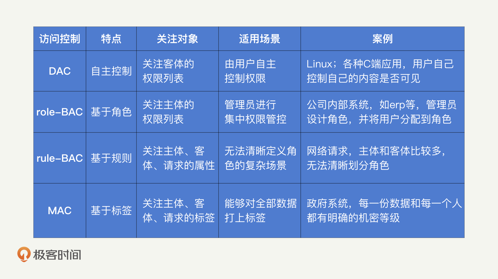

# 安全原则
CIA 三元组原则，是安全领域内最基础也最重要的原则。

　　（1）机密性（Confidentiality）用一句话来说就是，确保数据只被授权的主体访问，不被任何未授权的主体访问。简单用一个词总结就是“不可见”。

　　（2）完整性（Integrity）就是确保数据只被授权的主体进行授权的修改，简单来说，就是“不可改”。

　　（3）可用性（Availability）就是确保数据能够被授权的主体访问到 ，简单来说，就是“可读”。
# 黄金法则
黄金法则主要包含三部分：认证（Authentication）、授权（Authorization）、审计（Audit）。这三部分其实是一种串联的关系，它描述的其实是用户在使用应用过程中的生命周期：先进行登录、再进行操作、最后留下记录。

　　（1）认证其实包括两个部分：身份识别和认证。身份识别强调的是主体如何声明自己的身份，而身份认证强调的是，主体如何证明自己所声明的身份是合法的。比如说，当你在使用用户名和密码登录的过程中，用户名起到身份识别的作用，而密码起到身份认证的作用。

　　（2）除了对“你能做什么”进行限制，授权机制还会对“你能做多少”进行限制。比如，手机流量授权了你能够使用多少的移动网络数据。最原始和最安全的授权机制，一定是你的每一次操作，都经过了管理人员的审批和确认。

　　（3）当你在授权下完成操作后，安全需要检查一下“你做了什么”，这个检查的过程就是审计。当发现你做了某些异常操作时，安全还会提供你做了这些操作的“证据”，让你无法抵赖，这个过程就是问责。

　　大部分情况下，事前防御属于认证，事中防御属于授权，事后防御属于审计。
# 密码学
（1）对称加密，代表加密和解密使用的是同一个密钥。经典的对称加密算法有 DES、IDEA、AES、国密 SM1 和 SM4。

　　（2）非对称加密代表加密和解密使用不同的密钥。具体的加解密过程就是，发送方使用公钥对信息进行加密，接收方收到密文后，使用私钥进行解密。经典的非对称加密算法包括：RSA、ECC 和国密 SM2。

　　（3）散列算法应该是最常见到的密码学算法了。大量的应用都在使用 MD5 或者 SHA 算法计算一个唯一的 id。

# 身份认证
身份认证可以分为两个部分：对外认证和对内认证。对外认证，其实就是应用的登录注册模块，它面向用户进行认证。

　　除了应用本身需要有登录注册的模块，应用的各种内部系统同样需要涉及登录认证的功能，比如：服务器的登录、数据库的登录、Git 的登录、各种内部管理后台的登录等等。这也就是我所说的对内认证。

　　对外认证是单一场景下的认证，对内认证是多场景下的认证。

　　当账号体系变得越来越复杂时，如何对这些账号进行统一的管理，是解决身份认证问题的关键。而单点登录（Single Sign On，SSO）就是一个非常有效的解决方案。

　　单点登录的概念很简单：用户只需要进行一次认证，就可以访问所有的网页、应用和其他产品了。CAS 是一个开源的单点登录框架，它不属于某一种单点登录的实现方式，而是提供了一整套完整的落地方案。

# 访问控制
“授权”和“访问控制”其实是同一个概念，都是允许或者禁止某个用户做某件事情。

　　一个主体请求一个客体，这个请求的授权由访问控制来完成。例如在用户去读取文件的过程中，用户是主体，读取这个操作是请求，文件是客体。

　　（1）主体：请求的发起者。主体可以是用户，也可以是进程、应用、设备等任何发起访问请求的来源。

　　（2）客体：请求的接收方，一般是某种资源。比如某个文件、数据库，也可以是进程、设备等接受指令的实体。

　　（3）请求：主体对客体进行的操作。常规的是读、写和执行，也可以进一步细分为删除、追加等粒度更细的操作。

　　常见的访问控制机制有 4 种：DAC、role-BAC、rule-BAC、MAC。

　　（1）DAC（Discretionary Access Control，自主访问控制）。DAC 就是让客体的所有者来定义访问控制规则。

　　你想要从图书馆中拿走一本书。这个时候，管理员说，“你经过这本书的所有人同意了吗？”这个过程就是 DAC。

　　（2）role-BAC（role Based Access Control，基于角色的访问控制）。role-BAC 就是将主体划分为不同的角色，然后对每个角色的权限进行定义。

　　当你想借书的时候，管理员说，“你是学生吗？”这个过程就是 role-BAC。

　　（3）rule-BAC（rule Based Access Control，基于规则的访问控制）。rule-BAC 就是制定某种规则，将主体、请求和客体的信息结合起来进行判定。

　　有一点需要我们注意，需要定义是“默认通过”还是“默认拒绝”。即当某次请求没有命中任何一条规则时，我们是应该让它“通过”还是“拒绝”呢？

　　如果你想要在图书馆借书，管理员会说，“根据规定，持有阅览证就可以借书。”

　　（4）MAC（Mandatory Access Control，强制访问控制）。MAC 是一种基于安全级别标签的访问控制策略。

　　在互联网中，主体和客体被划分为“秘密、私人、敏感、公开”这四个级别。MAC 要求对所有的主体和客体都打上对应的标签，然后根据标签来制定访问控制规则。

　　当你在图书馆排队借书的时候，听到管理员说：“初中生不能借阅高中生的书籍。”这就是一种强制访问控制。

　　相比较来说，DAC 是所有者对客体制定的访问控制策略，role-BAC 是管理员对主体制定的访问控制策略，而 rule-BAC 可以说是针对请求本身制定的访问控制策略。
