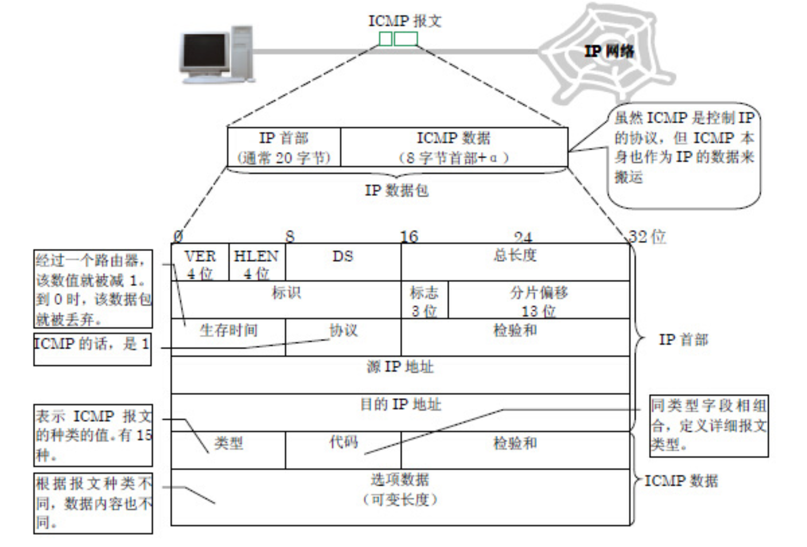
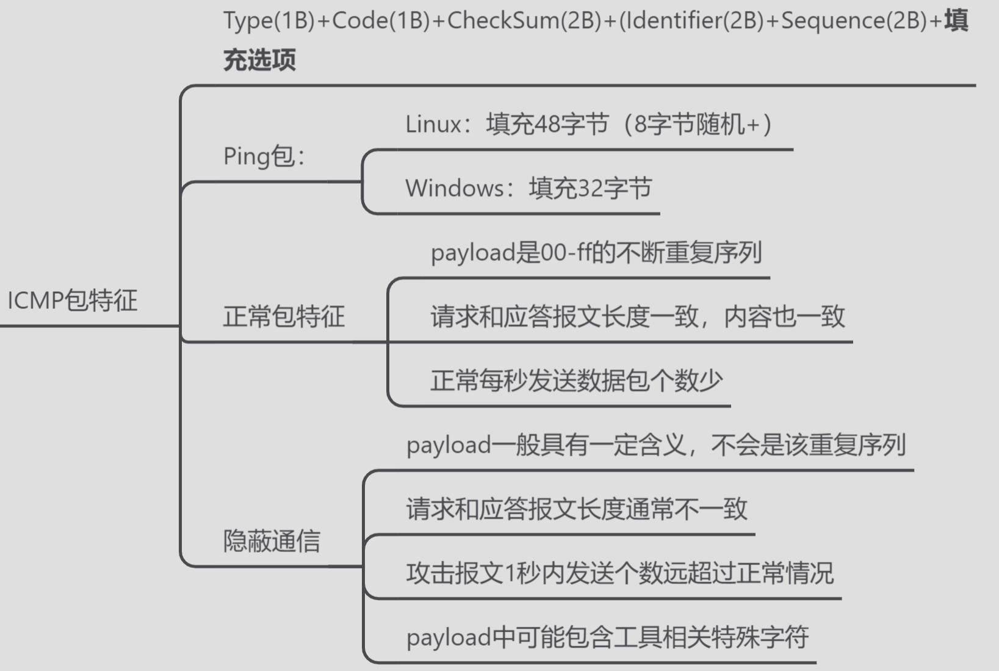
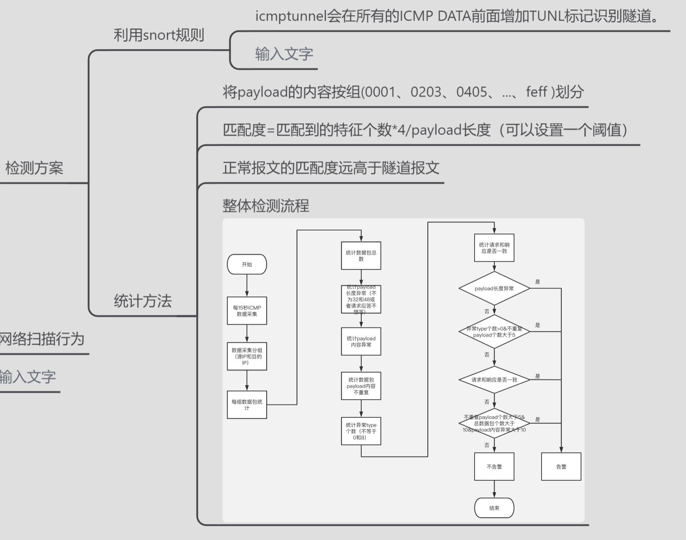

# ICMP协议

ICMP报文包含在IP数据报中，IP报头在ICMP报文的最前面。一个ICMP报文包括IP报头（至少20字节）、ICMP报头（至少八字节）和ICMP报文（属于ICMP报文的数据部分）。当IP报头中的协议字段值为1时，就说明这是一个ICMP报文。ICMP报头如下图所示。

# ICMP隐蔽隧道

ICMP隐蔽隧道的特征：

1、ICMP隧道短时间会产生大量 ICMP 数据包，用来数据发送，可能存在大于 64 比特的数据包。

2、ICMP隧道发送的 ICMP 数据包前后Data字段不一样，而且响应数据包中 payload 跟请求数据包不一致。

3、ICMP 数据包的协议标签可能存在特殊字段。例如，icmptunnel 会在所有的 ICMP Data 前面增加 ‘TUNL’ 标记以用于识别隧道

4、Data 里面可能存在一些系统命令防御和检测手段：

（1）禁止 ping（不太可能），会影响到很多运维和安全检测设备的运行。

（2）ICMP Data字段 形成一个白名单，不在白名单内的告警

（3）检测包大于多少，或者发送频率高于某个数，报警

（4）检测 Data里面包含的特殊字段报警

