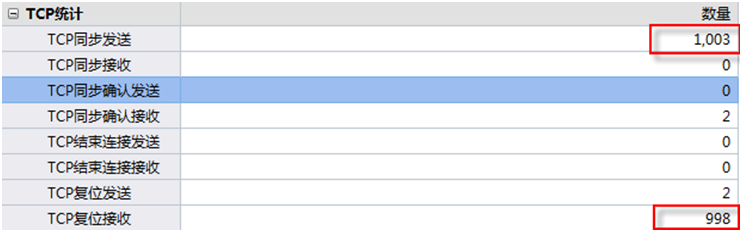
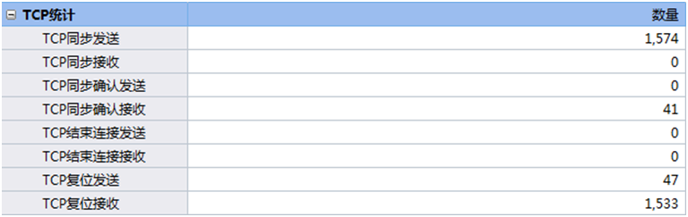
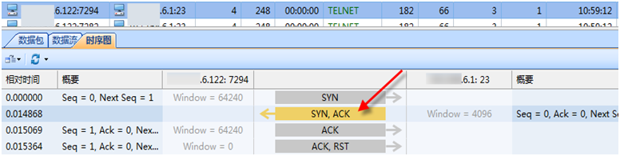

# 网络扫描行为
扫描的主要功能：

- 扫描目标主机识别其工作状态
- 识别目标主机端口的状态--》判断开启的服务、是否存在漏洞
- 识别目标主机操作系统的类型和版本
- 识别目标主机服务程序的类型和版本

第一阶段：发现目标主机或网络；

第二阶段：发现目标后进一步搜集目标信息，包括操作系统类型、运行的服务以及服务软件的版本等。如果目标是一个网络，还可以进一步发现该网络的拓扑结构、路由设备以及各主机的信息；

第三阶段：根据收集到的信息判断或者进一步测试系统是否存在安全漏洞。

行为特点：

- 网络层：同一源IP访问大量不同的目的IP
- 会话层：同一源IP访问同一目的IP的大量不同端口
- （一般情况下，IP和端口都具有连续的特征）
## 网络扫描方式
1、端口扫描的大致特征

- 小包多，大小基本在64-128字节之间；
- SYN置1，RST置1的数据包较多；
- 大量的TCP或UDP会话，且具有相同的会话特征；
- 采用连续端口或固定端口，尝试与目标主机连接；
- 诊断提示中会出现TCP复位，ICMP端口不达，甚至端口扫描提示。
2、了解端口扫描原理有哪些好处

- 快速定位蠕虫病毒；
- 快速确定攻击行为及类型；
- 快速厘清正常通讯与异常通讯；
- 快速发现网络中的异常行为。

### 主机扫描

主机扫描的目的是确定在目标网络上的主机是否可达。

- ICMP Echo扫描

利用Ping的实现机制，在判断在一个网络上主机是否开机时非常有用。向目标主机发送ICMP Echo Request 数据包，等待回复的ICMP Echo Reply 数据包。如果能收到，则表明目标系统可达，否则表明目标系统已经不可达或发送的包被对方的设备过滤掉。

- ICMP Sweep扫描

使用ICMP Echo轮询多个主机称为ICMP Sweep扫描。对于小的或者中等网络使用这种方法来探测主机是一种比较可接受的行为，但对于一些大型网络这种方法就显得十分缓慢，原因是Ping在处理下一个请求之前将会等待正在探测主机的回应。扫描工具Nmap实现了ICMP sweep的功能。

- Broadcast ICMP扫描

其实现原理是将ICMP请求包的目标地址设为广播地址或网络地址，则可以探测广播域或整个网络范围内的主机。然而这种扫描方式有一定风险，可能引起广播风暴。

- TCP ACK扫描

ACK扫描发送一个只设置ACK标志位的数据包，目标主机端口无论是关闭还是开放状态，都会返回RST数据包。但ACK扫描不能确定目标主机的端口状态，可以确定对方主机是否存活，可以发现防火墙规则来确定防火墙的状态。

大量ACK标志位置1的数据包。

### 端口扫描

#### TCP SYN扫描

nmap -sS IP

TCP SYN扫描，通常又叫“半开放”扫描。因为它不必打开一个完整的TCP连接，只发送一个SYN包，就能做到打开连接的效果，然后等待对端的反应。如果对端返回SYN/ACK报文，则表示该端口处于监听状态，此时，扫描端则必须再返回一个RST报文来关闭此连接；返回RST报文表示该端口没有开放。

需要root权限

在TCP Flag统计中，TCP同步位发送和TCP复位接收较多，如下图所示。

会话数据包总计为2个或3个。3个包表示端口开放，2个包表示端口未开放

### TCP Connect扫描

TCP connect（）扫描，是一种常见的扫描方式。它通过操作系统与目标机器建立连接，而不是直接发送原始数据包。这与浏览器、P2P客户端以及大多数网络应用程序一样，建立连接由高层系统调用。执行这种扫描的最大好处是无需root权限，但会在系统日志里留下记录。所以当在日志系统里，看到同一系统的大量连接尝试，就应该知道系统被扫描了。

在TCP Flag统计中TCP同步位发送和TCP复位接收较多，同时会有少量的同步接受和复位包发送，如下图所示。

会话数据包总计为2-6个不等，需查看数据信息确认端口状态

### TCP FIN扫描

namp -sF -T4 <target ip>

TCP FIN扫描技术使用FIN数据包探测端口。当一个FIN数据包到达一个关闭的端口，数据包会被丢掉，且返回一个RST数据包。当一个FIN数据包到达一个打开的端口，数据包只是简单丢掉（不返回RST数据包）。由于这种技术不包含标准的TCP三次握手协议的任何部分，所以无法被记录下来，从而比SYN扫描隐蔽的多。

秘密扫描能躲避IDS、防火墙、包过滤器和日志审计，从而获取目标端口的开放或关闭的信息。 但和SYN扫描类似，秘密扫描也需要构造自己的IP包。

TCP FIN扫描**通常适用于UNIX目标主机**。在Windows NT环境下，该方法无效，因为不论目标端口是否打开，操作系统都发送RST。这在区分UNIX和NT时，是十分有用的。

## 检测方法

# 蠕虫传播

# 僵尸网络

# 参考链接

- [如何分析理解端口扫描行为 - 科来 (colasoft.com.cn)](http://www.colasoft.com.cn/network-security-analysis/d12z.php)
- 