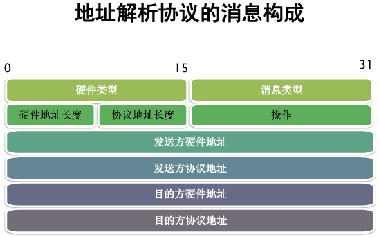

- [网络体系结构](#网络体系结构)
- [ARP协议](#arp协议)
  - [简介](#简介)
  - [安全威胁](#安全威胁)
    - [1.ARP窃听](#1arp窃听)
    - [2.ARP欺骗](#2arp欺骗)
    - [3.GARP滥用攻击](#3garp滥用攻击)
  - [检测方式](#检测方式)
  - [防御方式](#防御方式)
- [IP协议](#ip协议)
  - [简介](#简介-1)
  - [安全威胁](#安全威胁-1)
    - [1.IP窃听](#1ip窃听)
    - [2.IP地址假冒攻击](#2ip地址假冒攻击)
    - [3.IP碎片攻击](#3ip碎片攻击)
  - [防御方式](#防御方式-1)
- [TCP协议](#tcp协议)
  - [简介](#简介-2)
  - [安全威胁](#安全威胁-2)
    - [1.SYN泛洪攻击](#1syn泛洪攻击)
      - [分析nmap扫描开放端口的网络流量](#分析nmap扫描开放端口的网络流量)
    - [2.ACK泛洪攻击](#2ack泛洪攻击)
    - [3.序列号预测攻击](#3序列号预测攻击)
    - [4.LAND攻击](#4land攻击)
  - [防御方式](#防御方式-2)
- [UDP协议](#udp协议)
  - [简介](#简介-3)
  - [安全威胁](#安全威胁-3)
    - [1.假冒攻击](#1假冒攻击)
    - [2.劫持攻击](#2劫持攻击)
    - [3.泛洪攻击](#3泛洪攻击)
  - [防御方式](#防御方式-3)
- [HTTP协议](#http协议)
  - [简介](#简介-4)
  - [安全威胁](#安全威胁-4)
  - [防御方式](#防御方式-4)
- [参考链接](#参考链接)
## 网络体系结构

## ARP协议

### 简介

**地址解析协议（Address Resolution Protocol）**：根据IP地址获取物理地址的一个TCP/IP协议。主机发送信息时将包含目标IP地址的ARP请求广播到网络上的所有主机，并接收返回的ARP应答消息，以此确定目标的物理地址。

### 安全威胁

#### 1.ARP窃听

窃听用户隐私，造成用户数据泄露

基于明文传输的应用，都可以被窃取

#### 2.ARP欺骗
ARP欺骗攻击的核心思想是：向目标主机**发送伪造的ARP应答**，用伪造的IP-MAC地址间的映射更新目标主机的ARP缓存。

攻击流程分析：

正常网络环境：路由器与受害主机正常通信，双方ARP表中存储正确的对方的MAC地址

攻击者入侵后：路由器ARP缓存表中，受害者IP-攻击者MAC；受害者ARP缓存表中，路由器IP-攻击者MAC

从而实现中间人攻击。

对应流量包分析：

1.arp请求包，是一个广播包，请求包中的目的地址应该为全f，而这里为一个确定的MAC地址，说明该请求包是发向一个特定的目标。该包定点向受害者主机，发送ARP请求包，询问MAC地址。

并且在ARP请求包中，设置的MAC地址为攻击者的MAC，而IP是路由器的，目的是为了让ARP响应包发送回攻击者。

2.ARP响应包

3.未经请求的ARP响应包，更新受害者ARP表，这样后续受害者想与路由器进行通信时，实质上是与攻击者通信

#### 3.GARP滥用攻击

### 检测方式

**分析流量包：**

- 多个ARP响应包中，不同的IP地址对应同一个MAC地址
- 使用嗅探软件发现局域网内存在大量arp应答包（ARP缓存采用“后到优先”原则，IP与MAC的映射信息能被覆盖）

**实际应用场景中：**

- 受攻击机性能影响，网速时快时慢且极其不稳定，局域网内频繁性区域或整体掉线，重启计算机或网络设备后恢复正常；
- 网上银行、游戏及QQ账号的频繁丢失；
- 使用arp -a命令查看的网关mac地址与真实的网关mac地址不同

### 防御方式

1. 交换机或网络设备

   部署**动态ARP监测技术（DAI，Dynamic ARP Inspection）**

   ①交换机记录每个接口对应的IP地址和MAC，即**port<->mac<->ip**，生成DAI检测表；

   ②交换机检测每个接口发送过来的ARP回应包，根据DAI表判断是否违规，若违规则丢弃此数据包并对接口进行惩罚。

2. 普通主机

   1. ARP安全产品（360安全卫士、腾讯电脑管家；专业ARP防火墙）

      ①绑定正确的的IP和MAC映射，收到攻击包时不被欺骗。

      ②能够根据网络数据包特征（参考上一篇讲解的ARP攻击数据包溯源分析），自动识别局域网存在的ARP扫描和欺骗行为，并做出攻击判断（哪个主机做了攻击，IP和MAC是多少）。

   2. ARP双向绑定

      直接静态绑定

      ①进入命令行cmd界面；

      ② [arp -s ip地址 mac地址]，例如：arp -s 192.168.1.1 00-11-22-a1-c6-09

## IP协议

### 简介

### 安全威胁

#### 1.IP窃听

#### 2.IP地址假冒攻击

#### 3.IP碎片攻击

### 防御方式

## TCP协议

### 简介

tcp.flags.syn==1 && tcp.flags.ack==0  可用于过滤每一个会话的初始SYN数据包,然后为每一个TCP会话设置不同的颜色，便于后续分析每一个会话信息

### 安全威胁

#### 1.SYN泛洪攻击

##### 分析nmap扫描开放端口的网络流量
使用nmap利用**SYN数据包**扫描目标主机开放端口时，主要有三种情况：
1. 端口开放
   1. 攻击者-->受害者：SYN数据包
   2. 受害者-->攻击者：回复一个SYN/ACK数据包
   3. 受害者-->攻击者：超时未收到ACK包，会重传SYN/ACK数据包，一共重传3次
2. 端口关闭，
   1. 攻击者-->受害者：SYN数据包
   2. 受害者-->攻击者：回复一个RST数据包，说明端口关闭
3. 对端口的请求过滤了
   1. 攻击者未收到任何响应
   

分析流量包对应结果：

#### 2.ACK泛洪攻击

#### 3.序列号预测攻击

#### 4.LAND攻击

### 防御方式

## UDP协议

### 简介

### 安全威胁

#### 1.假冒攻击

#### 2.劫持攻击

#### 3.泛洪攻击

### 防御方式

## HTTP协议

### 简介

### 安全威胁

### 防御方式

## 参考链接
- [arp欺骗攻击与防范技术总结和分析](https://blog.csdn.net/whoim_i/article/details/104194975)
